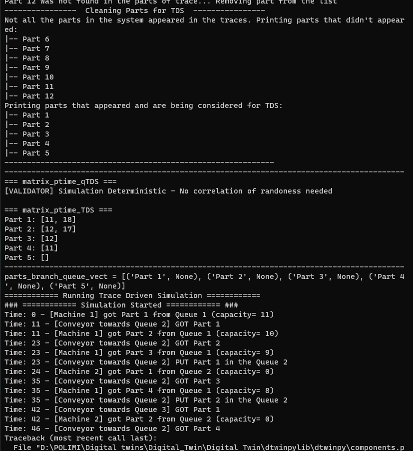

# 3.22.10.05
testing sync

mydt = Digital_Twin(
    name= "5s_determ",
    template= True, 
    Freq_Sync= 30, 
    Freq_Valid= 60, 
    Freq_Service= 10000, 
    delta_t_treshold=21,
    ip_address=factory_ip,
    flag_API= True,
    rct_threshold= 0,
    rct_queue= 2,
    flag_external_service= False,input_threshold=0.2, logic_threshold=0.2)

error from mydt.py :

