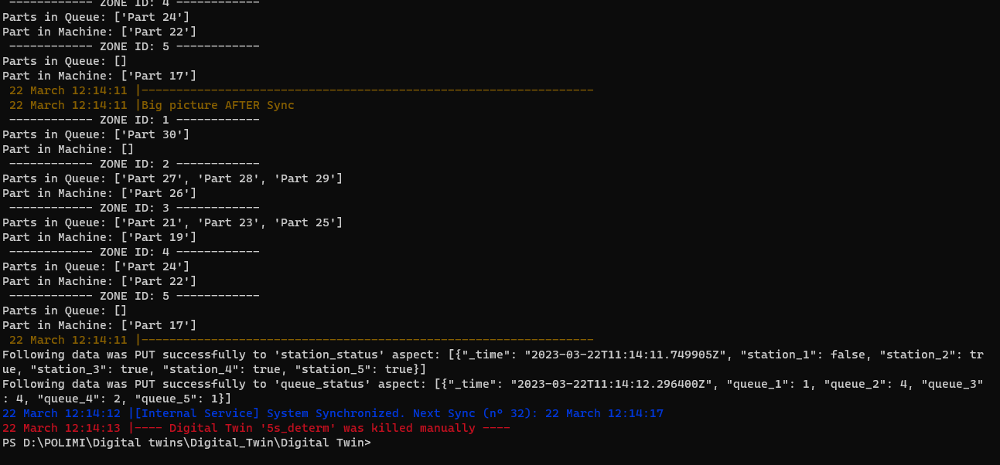

# test 3.22.12.08

running sync with faster speed

mydt = Digital_Twin(
    name= "5s_determ",
    template= True, 
    Freq_Sync= 15, 
    Freq_Valid= 10000, 
    Freq_Service= 10000, 
    delta_t_treshold=21,
    ip_address=factory_ip,
    flag_API= True,
    rct_threshold= 0,
    rct_queue= 2,
    flag_external_service= False)

terminal outpt:

