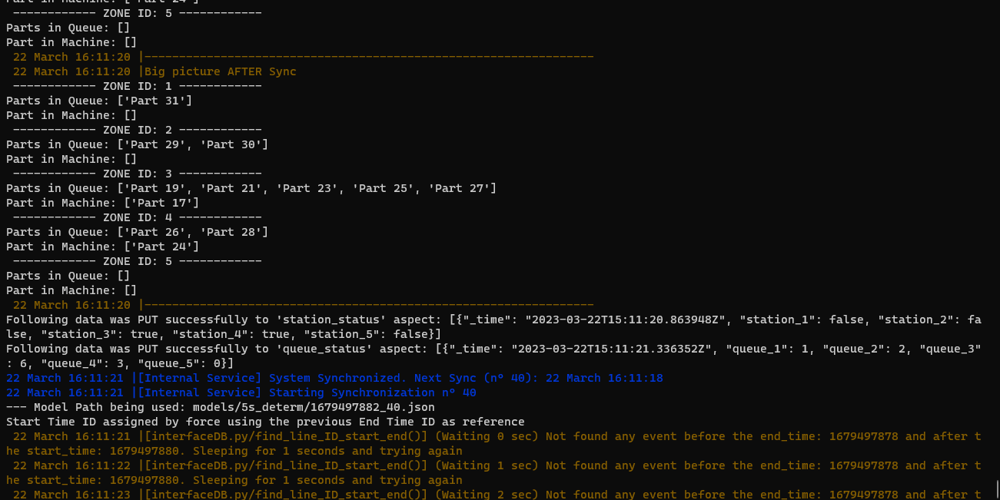
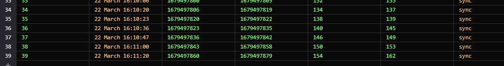
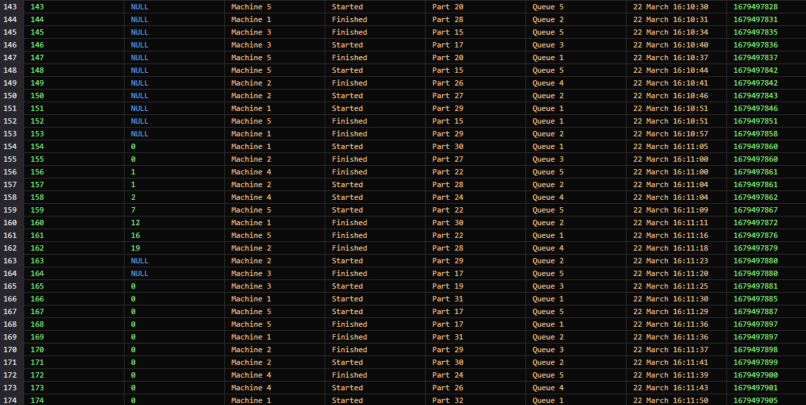

# test 3.22.16.40

test sync with 10s freq

mydt = Digital_Twin(
    name= "5s_determ",
    template= True, 
    Freq_Sync= 10, 
    Freq_Valid= 10000, 
    Freq_Service= 10000, 
    delta_t_treshold=21,
    ip_address=factory_ip,
    flag_API= True,
    rct_threshold= 0,
    rct_queue= 2,
    flag_external_service= False)

    Error in output terminal: 

BUG:
A possible problem could be that the time stamp flag update for the start time was delayed and probably the error accumulated over time. The end time which was calculated directly based on the freq_sync did not have this problem giving us a start time after the end time.