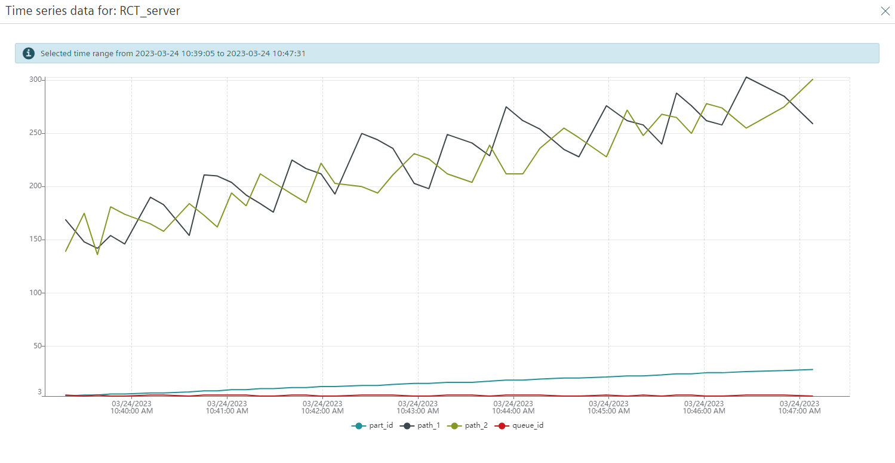
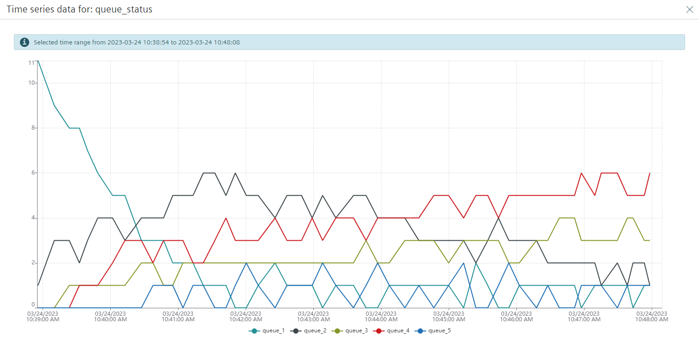

# test 3.24.10.53
## Objective

test the system with rct on till how far the system runs.

## Observations and Comments
the test was stopped when there were no longer any parts accumulating in the queue2.

we can also see the queue buffer size requirement changing.

