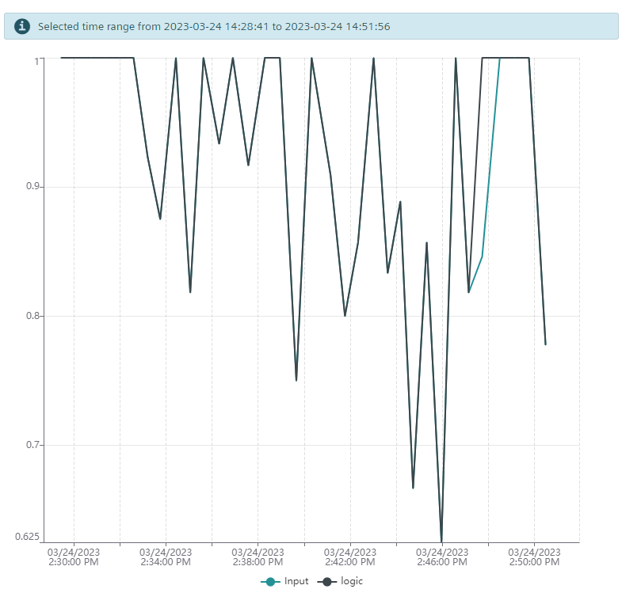

# test 3.24.14.56
## Objective

test validation with real system, where LCSS is capped at 1.0. use high threshold

## Observations and Comments
system ran with value above 0.8 for first 15 minutes. then, station 2 and then station 5 was blocked manually to induce variations. Then, we get values less than 0.8.

