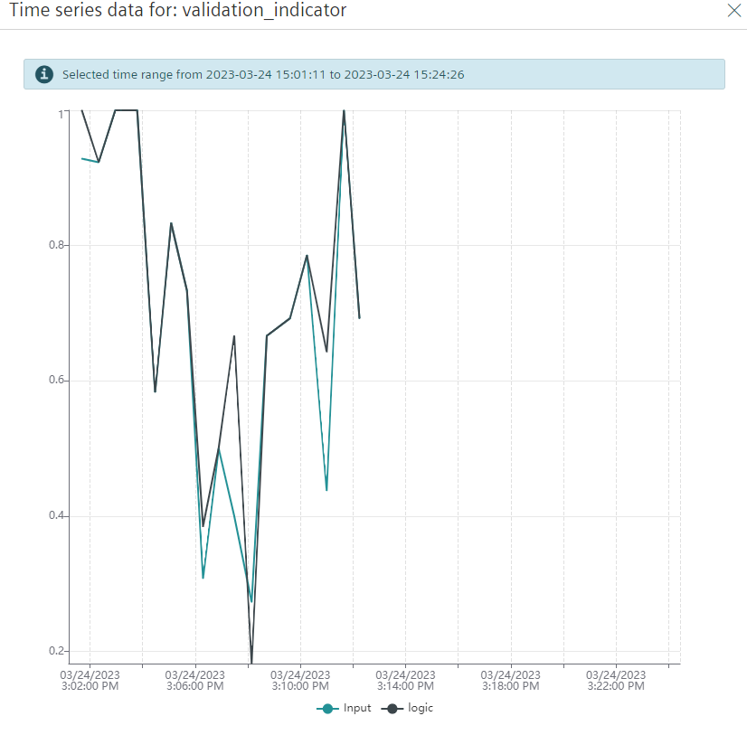

# test 3.24.15.13
## Objective

test validation with delta_t = 5 on real system

## Observations and Comments
system was good till the station 2 started getting blocked by queue3. difference in logic and input validation is visible in the indicator values.

