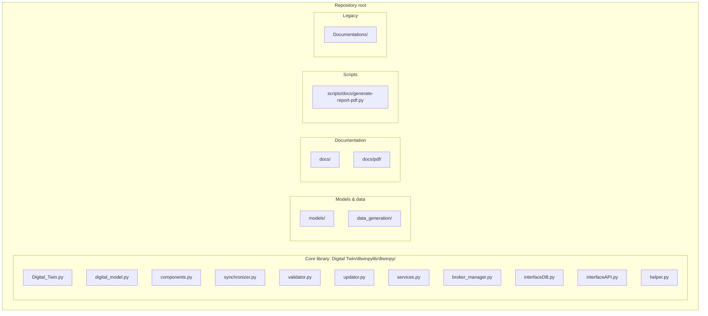
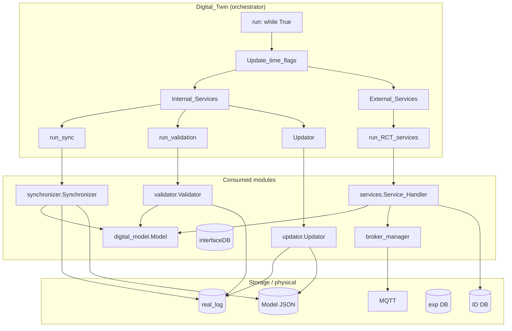
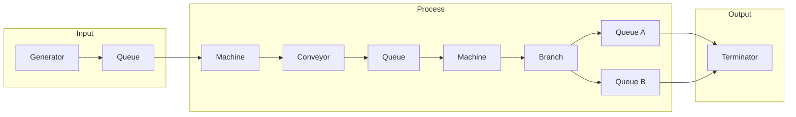
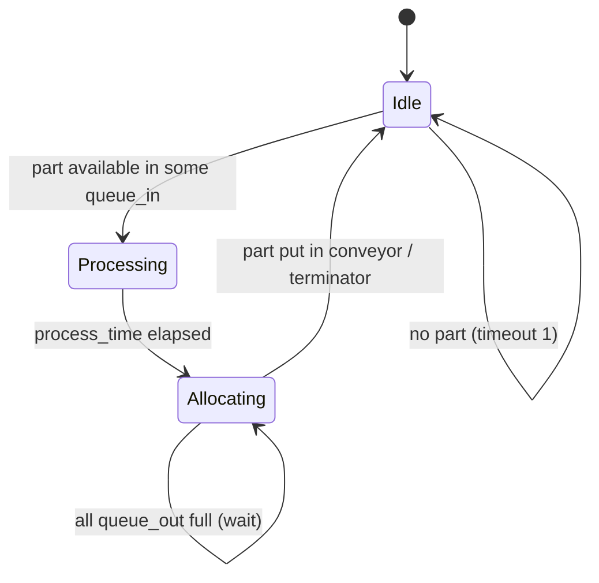
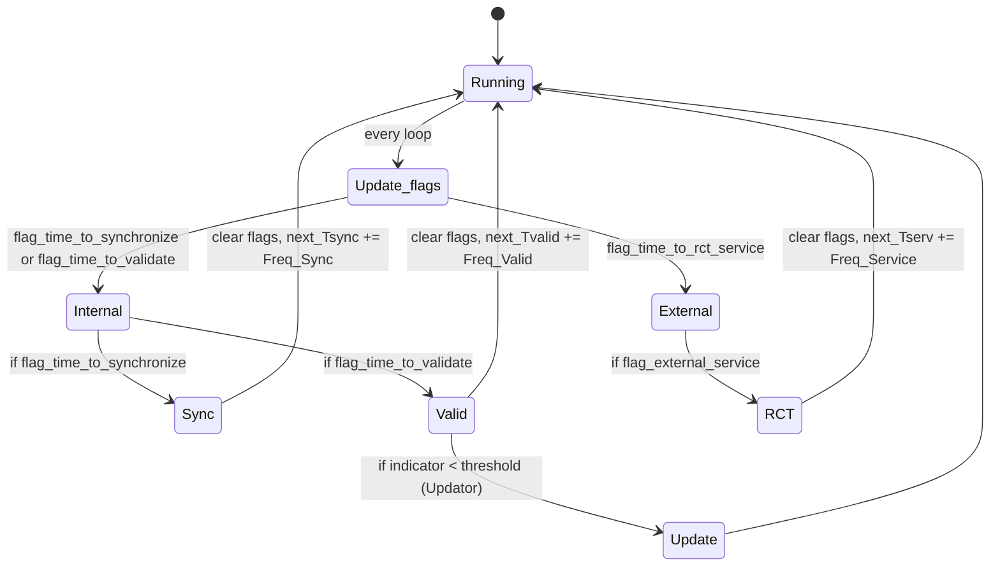
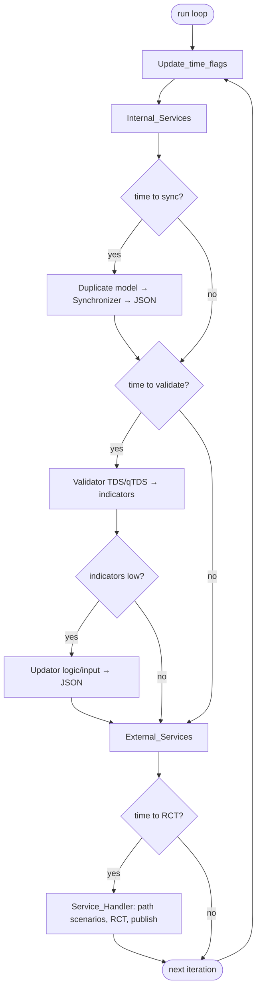
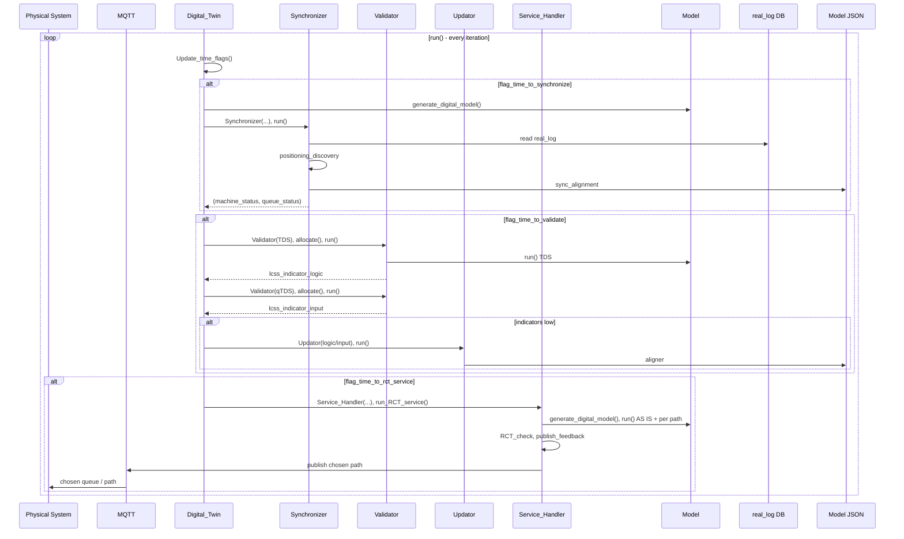

# Digital_Twin

Digital_Twin is a **discrete‑event Digital Twin for machine‑sequence processes**.  
The core library is **`dtwinpy`**, and the top‑level orchestrator is the **`Digital_Twin`** class in `Digital Twin/dtwinpylib/dtwinpy/Digital_Twin.py`.

The orchestrator does **not** implement the low‑level simulation itself: it builds and runs a digital model, synchronizes it with a real system, validates and updates the JSON model, and exposes an **RCT‑based decision service** that recommends the best path at branching machines.

For a full technical description of the orchestrator see: `docs/0008-report-digital_twin.md`.

---

## Repository structure (high level)

The **principal library code** lives under **`Digital Twin/dtwinpylib/dtwinpy/`**. The rest of the repo is models, docs, and scripts.



| Area | Path | Description |
|------|------|-------------|
| **Core library** | `Digital Twin/dtwinpylib/dtwinpy/` | Main Python package: orchestrator, model, components, sync, validation, update, RCT service, broker, DB, API, helper. |
| **Models** | `Digital Twin/models/` | JSON models (nodes/arcs/initial), snapshots, test scenarios (e.g. `5s_determ/`, `5s_stho/`). |
| **Data generation** | `Digital Twin/data_generation/` | Experimental runs and data‑generation utilities. |
| **Reports** | `docs/` | Technical reports 0001–0008 (Markdown); `docs/pdf/` holds generated PDFs and per‑report folders with diagram PNGs. |
| **Scripts** | `scripts/docs/` | Report PDF generation (Mermaid→PNG, Pandoc, CSS); `scripts/generate-report-pdf.ps1` delegates to it. |
| **Legacy** | `Documentations/` | Older notes, assumptions, tutorials, presentations, logbook. |

---

## Modules and how they work

The orchestrator **consumes** the modules below; it does not implement simulation or sync logic itself.



### Core library modules (`dtwinpy`)

| Module | Role |
|--------|------|
| **Digital_Twin.py** | Top-level orchestrator: owns model/DB paths, time flags, and calls Sync, Validator, Updator, Service_Handler in order. See [Main loop](#main-loop-flow) below. |
| **digital_model.py** | **Model** class: reads JSON (nodes/arcs/initial), builds SimPy model (machines, queues, conveyors, branches), runs simulation, computes RCT and cycle times. |
| **components.py** | Building blocks: **Part**, **Machine**, **Queue**, **Generator**, **Terminator**, **Conveyor**, **Branch**. Machines have a state machine (Idle → Allocating → Processing → …); branches choose output path (first, alternated, RCT, or explicit branching_path). |
| **synchronizer.py** | **Synchronizer**: reads `real_log` (real system events), replays events to discover part/machine positions, aligns digital model state (WIP, `worked_time`, `allocation_counter`) and writes the updated snapshot to the model JSON. |
| **validator.py** | **Validator**: builds two digital runs (TDS = machine events, qTDS = queue events), compares with real traces via LCSS, returns logic and input indicators. Used to decide if the model needs updating. |
| **updator.py** | **Updator**: when validation indicators are low, updates the JSON—`logic` (stub) or `input` (process times from real qTDS traces). Writes to `model_last_sync`. |
| **services.py** | **Service_Handler**: RCT service. Gets parts at branch queues, generates path scenarios, runs the model once per path (and once “AS IS”), compares RCT, selects best path above threshold, publishes to MQTT and writes to exp DB. |
| **broker_manager.py** | MQTT (or similar) publishing: start/stop, feedback (chosen queue/path to physical system). |
| **interfaceDB.py** | Database access: time pointers, real/digital/ID/experimental DB paths, write indicators and RCT results. |
| **interfaceAPI.py** | Optional API: station status, queue status, indicators, RCT server (called after sync, validation, RCT service). |
| **helper.py** | Logging, time, file copy/delete, printer, kill. |

### How the simulation layer fits together

The **Model** (digital_model.py) builds a SimPy graph from the JSON: nodes become **Machines**, arcs become **Queues** and **Conveyors**. **Parts** flow through queues → machines → conveyors → next queues. At **branching** machines, **Branch** (and allocation policy) decides which output path a part takes.



- **Generator** places initial WIP (parts) in queues from the JSON `initial` array.
- **Machine**: state machine (Idle → Processing → Allocating → Idle); takes one part from input queue(s), processes it, sends it via a **Conveyor** (delay) to an output queue. At a branch, **Branch** + allocation policy (or part’s `branching_path`) choose the output conveyor.
- **Terminator** receives finished parts; in closed loop it can re-inject a part at the start.

---

## State diagrams

### Machine state (components.py)

Each **Machine** runs as a SimPy process with this state machine:



- **Idle:** Check input queues; if any has a part, select queue and move to **Processing**.
- **Processing:** Get part, apply process time (fixed or distribution / TDS / qTDS), then move to **Allocating**.
- **Allocating:** Choose output by policy (first, alternated, branching, rct); put part in conveyor (or terminator); if output full, wait and stay in Allocating; else back to **Idle**.

### Digital Twin — time and flags (Digital_Twin.py)

The main loop is always **Running**; each iteration it **updates time flags** and may run **Internal** (Sync, then Validate + Update) and **External** (RCT) services. When a service runs, flags are cleared and the next scheduled time is advanced.



- **Freq_Sync**, **Freq_Valid**, **Freq_Service** define the intervals; when `timestamp >= next_T*`, the corresponding flag is set and that service runs once, then the next time is updated.

---

## Digital_Twin orchestrator (summary)

The **Digital_Twin** class owns the model and DB paths, schedules internal and external services with time-based flags, and runs the main loop.

- **Model and DB paths**: Tracks `model_path`, `model_root`, `model_subpath_dict` (snapshots per sync), and paths for digital, real, ID, and experimental databases.
- **Time scheduling**: Uses `Freq_Sync`, `Freq_Valid`, `Freq_Service` and sets `flag_time_to_synchronize`, `flag_time_to_validate`, `flag_time_to_rct_service` from `next_Tsync`, `next_Tvalid`, `next_Tserv`.
- **Internal_Services**: If time to sync → duplicate model, run **Synchronizer** (real_log → JSON). If time to validate → run **Validator** (TDS/qTDS, LCSS), then optionally **Updator** (logic/input) if indicators are below thresholds.
- **External_Services**: If time to RCT → run **Service_Handler** (path scenarios, RCT comparison, publish best path via broker, write to exp DB).
- **run()**: Sends `'start'` at init and `'stop'` on KeyboardInterrupt via the broker.

### Main loop flow

Each iteration of `run()`: update time flags, then run internal services (sync, then optionally validation + update), then external services (RCT).



For step-by-step flows and more sequence diagrams (Sync-only, etc.), see `docs/0008-report-digital_twin.md`.

---

## Sequence diagrams

### Global sequence — main loop and services

Every iteration of `run()`: time flags → optional Sync → optional Validation + Updator → optional RCT service. Data flow between Digital_Twin, modules, and storage:



### More sequence diagrams

- **Sync only** (detail: Digital_Twin → generate_digital_model → Synchronizer → JSON): `docs/0008-report-digital_twin.md` § 8.
- **Validation** and **RCT service** sequences: same report, later sections.
- **Synchronizer** step-by-step and sequence: `docs/0004-report-synchronizer.md`.
- **Validator** and **Services** flows: `docs/0005-report-validator.md`, `docs/0007-report-services.md`.

---

## Getting started

1. **Install Python and dependencies**  
   - Create a virtual environment and install the `dtwinpy` package (local) plus any extra requirements you need.

2. **Choose or create a model JSON**  
   - Use one of the test models under `Digital Twin/models/` (e.g. `5s_determ/initial.json`) or create your own following `docs/0001-report-models.md`.

3. **Instantiate the Digital Twin** (simplified sketch):

   ```python
   from dtwinpy.Digital_Twin import Digital_Twin

   dt = Digital_Twin(
       name="5s_determ",
       model_path="Digital Twin/models/5s_determ/initial.json",
       flag_external_service=True,
       flag_validation=True,
       # ... thresholds, DB paths, MQTT IP, etc.
   )

   dt.run()  # main loop (sync, validate, update, RCT service)
   ```

4. **Learn more**  
   - Start with `docs/0008-report-digital_twin.md` (or its PDF) to understand the orchestrator, then dive into `docs/0002`, `0003`, `0004`, `0005`, `0006`, and `0007` for each module.

