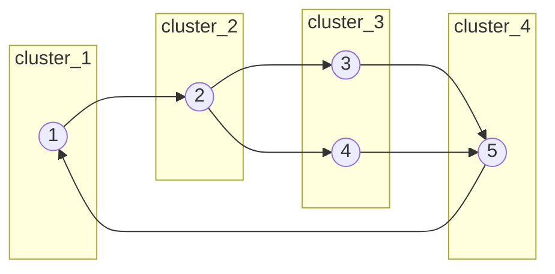

# 0001 — Report: Models Folder and JSON Structure of the Digital Twin

## 1. General context

This repository implements a **Digital Twin**: a digital model that represents a physical **machine-sequence processing** process. The twin allows simulating different scenarios and, in particular, a service uses the digital model to simulate and find the **most efficient path**, returning feedback to the physical world.

The **models** are the graph representation of the process: **nodes** (activities/machines) and **arcs** (connections/queues). The JSON files under `Digital Twin/models` define this topology and the initial state (parts in queues, times, etc.).

---

## 2. Structure of the `models` folder

The folder `Digital Twin/models` contains test scenarios and templates. Each subfolder or file represents a type of model (deterministic, stochastic, full queue, etc.).

```
Digital Twin/models/
├── 5s_stho/                    # 5 stations, stochastic (stho)
│   └── 1681234301_62.json      # snapshot of model with state
├── 5s_determ/                  # 5 stations, deterministic
│   └── initial.json
├── 5s_alternating/
├── 5s_capcity_error/
├── 5s_dist.json                # model with distributions
├── 5s_stho_template.json       # stochastic template
├── template_5s.json            # generic 5-station template
├── batch_rct/
├── CT/
├── debug_tracking/
├── debug_valid/
├── debug_rct/
├── debug_update/
├── queue_full/
└── ...
```

- **`5s_*`**: models with 5 stations (5 nodes).
- **`*_stho`**: stochastic times/parameters (e.g. normal distribution).
- **`*_determ`**: deterministic times (fixed values).
- **`initial.json`**: “clean” initial state of the model; other files (e.g. `1681234301_62.json`) are snapshots with simulation state (WIP, `worked_time`, etc.).

---

## 3. Model JSON structure

Every model is a JSON with three main blocks: **`nodes`**, **`arcs`**, and **`initial`**.

### 3.1 Overview

| Key      | Description |
|----------|-------------|
| `nodes`  | List of activities/machines (graph vertices). |
| `arcs`   | List of connections between machines (edges + queues). |
| `initial`| Initial state: for each queue (index = order of arcs), list of parts (e.g. `["Part 26", "Part 27"]`). |

---

### 3.2 `nodes` — Activities / Machines

Each element in `nodes` is an object with the fields below. The **`activity`** field is the **activity ID** (used in `predecessors`/`successors` references and in `arcs`).

| Field                | Type        | Description |
|----------------------|-------------|-------------|
| `activity`           | int         | Activity (node) ID. |
| `predecessors`       | [int]       | IDs of activities that precede this one. |
| `successors`         | [int]       | IDs of activities that succeed this one. |
| `frequency`          | number      | Operation frequency (e.g. 999). |
| `capacity`           | int         | Machine capacity (e.g. 1). |
| `contemp`            | number or `["norm", μ, σ]` | Process time: fixed value or normal distribution (mean μ, std σ). |
| `cluster`            | int         | Logical grouping (cluster) of the machine. |
| `worked_time`        | 0 or [time, "Part N"] | 0 = idle; [t, "Part N"] = processing "Part N" for t time units. |
| `allocation_counter`  | int (optional) | Counter for allocation policy on branching machines. |

**Example (excerpt from `1681234301_62.json`):**

```json
{
  "activity": 2,
  "predecessors": [1],
  "successors": [3, 4],
  "frequency": 999,
  "capacity": 1,
  "contemp": ["norm", 17, 2],
  "cluster": 2,
  "worked_time": [1, "Part 26"],
  "allocation_counter": 1
}
```

- Activity **2** is preceded by **1** and succeeded by **3** and **4** (branching).
- Process time: normal(17, 2).
- In this snapshot: processing "Part 26" for 1 time unit; `allocation_counter` used for alternating between successors.

---

### 3.3 `arcs` — Connections / Queues

Each arc links two activities and represents a **queue** between them (capacity, transport time, etc.).

| Field      | Type   | Description |
|------------|--------|-------------|
| `arc`      | [int, int] | Pair [source, target] (activity IDs). |
| `capacity` | int   | Maximum queue capacity. |
| `frequency` | number | Arc frequency (e.g. 1000). |
| `contemp`  | number | Transport time on the connection. |

**Example:**

```json
{"arc": [2, 3], "capacity": 10, "frequency": 1000, "contemp": 23}
```

I.e. queue from activity **2** to **3**, capacity 10, transport time 23.

---

### 3.4 `initial` — Initial state (WIP)

`initial` is an **array of arrays**. Index **i** corresponds to the **i-th queue** (order of `arcs` in the JSON). Each element is the list of parts in that queue at simulation start.

**Example (excerpt from `1681234301_62.json`):**

```json
"initial": [
  ["Part 27"],
  [],
  ["Part 19", "Part 21", "Part 23", "Part 25"],
  ["Part 20", "Part 22", "Part 24"],
  ["Part 16"]
]
```

- Queue 0: 1 part (Part 27).
- Queue 1: empty.
- Queues 2 and 3: several parts listed.
- Queue 4: Part 16.

The code extracts the **numeric ID** from the name (e.g. `"Part 27"` → 27) and creates `Part` objects assigned to the correct queues in the model. In general, the length of `initial` matches the number of **arcs** (one entry per queue); if there are fewer entries, the last queues have no initial parts.

---

## 4. Full example: `5s_stho/1681234301_62.json`

This file models a system with **5 activities** and **6 arcs** (including the cycle closure).

### 4.1 Activity graph (nodes)



- **1** → **2** (sequence).
- **2** → **3** and **2** → **4** (branching).
- **3** and **4** → **5** (convergence).
- **5** → **1** (closed loop).

### 4.2 Nodes table (summary)

| activity | predecessors | successors | contemp     | cluster |
|----------|--------------|------------|-------------|---------|
| 1        | [5]          | [2]        | norm(11,2)  | 1       |
| 2        | [1]          | [3, 4]     | norm(17,2)  | 2       |
| 3        | [2]          | [5]        | norm(52.5,2)| 3       |
| 4        | [2]          | [5]        | norm(52.5,2)| 3       |
| 5        | [3, 4]       | [1]        | norm(10,2)  | 4       |

### 4.3 Arcs table (order = index in `initial`)

| Index | arc  | capacity | contemp |
|-------|------|----------|---------|
| 0     | 1→2  | 10       | 11      |
| 1     | 2→3  | 10       | 23      |
| 2     | 2→4  | 10       | 20      |
| 3     | 3→5  | 10       | 11      |
| 4     | 4→5  | 10       | 6       |
| 5     | 5→1  | 12       | 9       |

### 4.4 Simplified logic flow (code usage)

1. **Load JSON** → `data = json.load(json_file)`.
2. **Create machines** → for each `node` in `data['nodes']`, instantiate `Machine` with `activity`, `contemp`, `cluster`, etc.
3. **Create queues** → for each `arc` in `data['arcs']`, instantiate `Queue` with `arc`, `capacity`, `contemp`.
4. **Link queues to machines** → `queue_allocation()`: for each queue, `arc[0]` → `queue_out` of source machine, `arc[1]` → `queue_in` of target machine.
5. **Initial state** → `initial_allocation()`: for each index `i` in `data['initial']`, place the listed parts in `queues_vector[i]`.

Excerpt in `digital_model.py` (machine and queue creation):

```python
# Create Machines
for node in data['nodes']:
    self.machines_vector.append(Machine(env=self.env, id=node['activity'],
        freq=node['frequency'], capacity=node['capacity'],
        process_time=node['contemp'], database=self.Database, cluster=node['cluster'],
        terminator=self.terminator, loop=self.loop_type, ...))

# Create Queues (arcs)
queue_id = 0
for arc in data['arcs']:
    queue_id += 1
    self.queues_vector.append(Queue(env=self.env, id=queue_id, arc_links=arc['arc'],
        capacity=arc['capacity'], freq=arc['frequency'], transp_time=arc['contemp']))
```

---

## 5. Relation to code (digital_model)

| Concept in JSON | Usage in code |
|-----------------|----------------|
| `nodes`         | `Model.machines_vector` — each node becomes a `Machine`. |
| `arcs`          | `Model.queues_vector` — each arc becomes a `Queue`. |
| `initial`       | `initial_allocation()` fills queues with `Part` at simulation start. |
| `contemp` (node) | Machine process time (supports fixed value or `["norm", μ, σ]`). |
| `contemp` (arc)  | Queue transport time. |
| `cluster`       | Grouping used in cluster logic and terminator. |
| `worked_time`   | “In progress” state; used to sync with the physical world. |
| `allocation_counter` | Alternation policy on branches. |

The **model_translator()** in `digital_model.py` is the central entry that reads the JSON and builds `machines_vector` and `queues_vector`, then calls `queue_allocation()`, `initial_allocation()`, `merge_queues()`, `discovery_working_parts()`, etc.

---

## 6. File naming and conventions

- **`initial.json`**: default initial state for the scenario (e.g. `5s_determ`, `batch_rct`).
- **`{timestamp}_{id}.json`** (e.g. `1681234301_62.json`): snapshot of a model at a given time (e.g. after sync with the physical system), possibly with updated `worked_time`, `allocation_counter`, and `initial`.
- **`*_template.json`**: reusable template (e.g. `5s_stho_template.json`), often with `worked_time: 0` and generic `initial`.

---

## 7. Summary

- The **`Digital Twin/models`** folder holds the graph (nodes + arcs) and initial state (WIP) of the Digital Twin.
- Each **node** = one machine/station; each **arc** = one queue between two machines.
- The **`initial`** array defines how many and which parts are in each queue at simulation start.
- **`5s_stho/1681234301_62.json`** is a full example: 5 stations, branching at 2→3 and 2→4, cycle 5→1, stochastic times, and filled WIP state.
- The **`digital_model.py`** module translates this JSON into `Machine` and `Queue` objects and uses this model to simulate and find the most efficient path, closing the feedback loop with the physical process.
