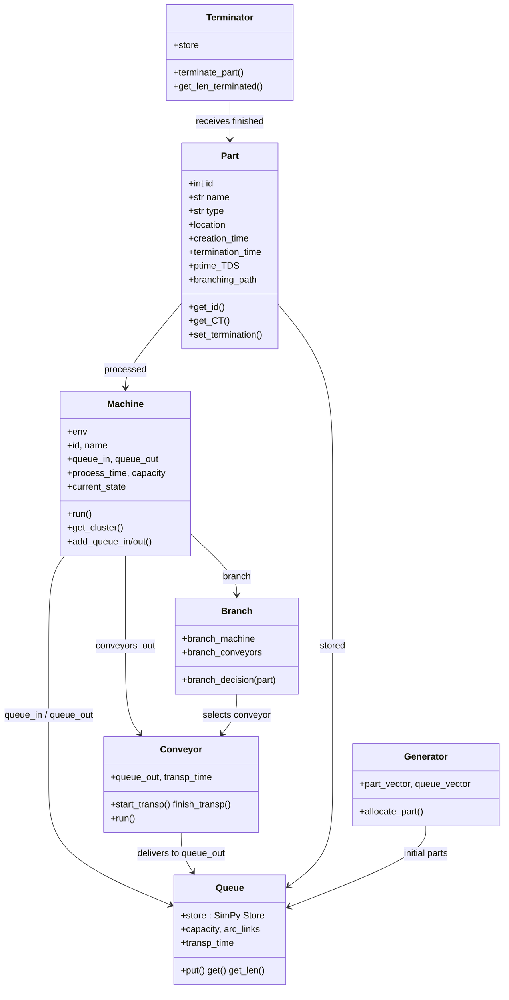
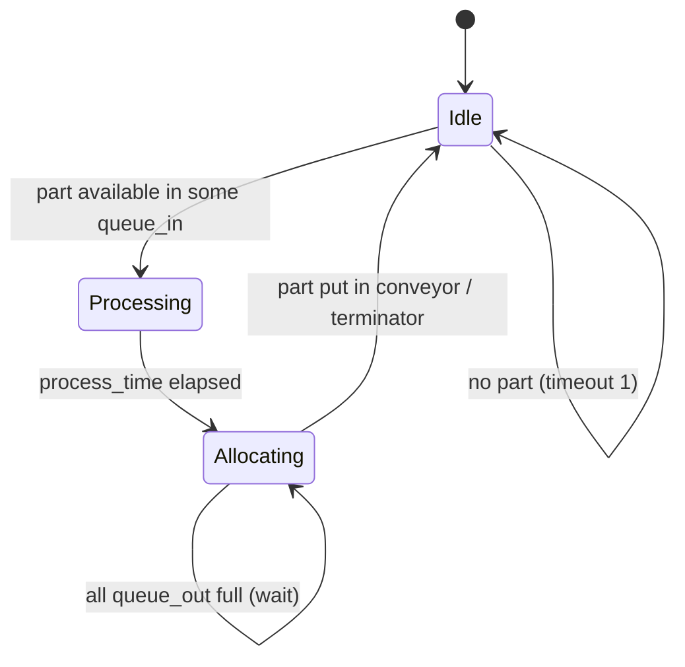
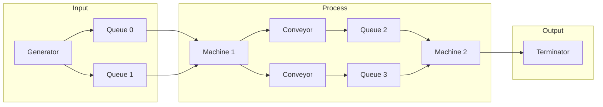

# 0002 — Report: components.py — Simulation Building Blocks

## 1. Purpose and role

The module **`dtwinpy/components.py`** defines the **discrete-event simulation building blocks** used by the Digital Twin. These components are assembled by `digital_model.py` from the graph JSON (nodes → machines, arcs → queues) and then run under SimPy to simulate the physical process and support services such as RCT (routing/optimization).

**Main responsibilities:**

- Represent **parts** (jobs) flowing through the system.
- Represent **machines** (activities) that take parts from input queues, process them, and send them to output queues (via **conveyors**).
- Represent **queues** (buffers between machines) and **conveyors** (transport with delay).
- Handle **branching** (one machine, multiple output paths) and allocation policies (first free, alternated, RCT, branching).
- Support **open/closed loop** via **Generator** (initial part placement) and **Terminator** (part completion and, in closed loop, part replacement).

---

## 2. Module layout and dependencies

```
components.py
├── Part           # Entity: part/job
├── Machine        # Resource: processes parts (state machine)
├── Queue          # Buffer: simpy.Store between machines
├── Generator      # Initial WIP: places parts in queues
├── Terminator     # Sink: receives finished parts (and replaces in closed loop)
├── Conveyor       # Transport: delay between machine output and next queue
└── Branch         # Logic: which output path to use for a part at a branching machine
```

**Imports:**

- `simpy` — environment, timeouts, stores.
- `Helper` from `.helper` — logging/printing.
- `scipy.stats` (`norm`, `expon`, `lognorm`) — process-time distributions (used when `process_time` is a list like `["norm", μ, σ]`).

---

## 3. Class overview (Mermaid)



---

## 4. Part

Represents a **part** (job) in the system.

### 4.1 Main attributes

| Attribute           | Type     | Description |
|---------------------|----------|-------------|
| `id`                | int      | Unique part ID. |
| `name`              | str      | `"Part " + str(id)`. |
| `type`              | str      | Part type (e.g. `"A"`). |
| `location`          | —        | Queue index (used by Generator for initial placement). |
| `creation_time`     | number   | SimPy time when part entered the system. |
| `termination_time`  | number   | SimPy time when part left (set by Terminator). |
| `ptime_TDS`         | list     | Trace-Driven Simulation: process times per cluster. |
| `finished_clusters` | int      | Number of clusters already completed (TDS). |
| `convey_entering_time` | number | When part entered current conveyor. |
| `branching_path`    | list     | Conveyors (or path) chosen for branching; used by Branch. |

### 4.2 Main methods

- **Getters:** `get_id()`, `get_name()`, `get_type()`, `get_location()`, `get_creation()`, `get_termination()`, `get_CT()`, `get_ptime_TDS(cluster)`, `get_branching_path()`, etc.
- **Setters:** `set_termination()`, `set_finished_clusters()`, `set_ptime_TDS()`, `set_convey_entering_time()`, `set_branching_path()`, etc.
- **`calculate_CT()`** — Cycle time: `termination_time - creation_time`.
- **`quick_TDS_fix(current_cluster)`** — Adjusts `ptime_TDS` for parts that join mid-flow (pads with zeros for finished clusters).

---

## 5. Machine

Represents a **machine** (activity/node). It runs as a SimPy process with a **state machine**: **Idle → Processing → Allocating → Idle**.

### 5.1 State diagram



- **Idle:** Check `queue_in`; if any queue has a part, choose one (e.g. first non-empty), set `queue_to_get`, move to **Processing**.
- **Processing:** Get part (from queue or `initial_part` if `worked_time != 0`). Compute process time (normal/TDS/qTDS), then `yield env.timeout(process_time)`. Then move to **Allocating**.
- **Allocating:** Choose output (queue/conveyor) by policy; if chosen queue is full, wait and retry; otherwise put part in conveyor (or send to terminator for final machine). Then move back to **Idle** (or trigger exit for open-loop / targeted part / maxparts).

### 5.2 Main attributes (selection)

| Attribute              | Description |
|------------------------|-------------|
| `env`                  | SimPy environment. |
| `id`, `name`           | Machine ID and `"Machine " + id`. |
| `queue_in`, `queue_out`| Lists of Queue objects (input/output). |
| `process_time`         | Fixed number or `["norm", μ, σ]` (and similar). |
| `capacity`             | Machine capacity (e.g. 1). |
| `current_state`        | `"Idle"` \| `"Processing"` \| `"Allocating"`. |
| `queue_to_get`, `queue_to_put` | Selected queue for current part. |
| `part_in_machine`      | Part currently being processed or allocated. |
| `conveyors_out`        | List of Conveyor objects (one per output queue). |
| `branch`               | Branch object if this machine is a branching point. |
| `allocation_policy`    | `"first"` \| `"alternated"` \| `"branching"` \| `"rct"`. |
| `allocation_counter`   | Index for alternated policy. |
| `parts_branch_queue`   | RCT: list of (part_name, queue_name) for routing. |
| `final_machine`        | True for the last machine in the loop. |
| `loop`                 | `"closed"` or `"open"`. |
| `terminator`           | Terminator that receives finished parts. |
| `worked_time`, `initial_part` | For sync: part already in machine at start. |
| `simtype`              | `None` \| `"TDS"` \| `"qTDS"` for process time source. |

### 5.3 Allocation policies (Allocating state)

- **first** — First output queue that is not full.
- **alternated** — Round-robin over `queue_out` via `allocation_counter`; if all full, wait and retry.
- **branching** — Use `branch.branch_decision(part)` to pick conveyor (and thus queue) from part’s `branching_path`.
- **rct** — Use `parts_branch_queue` to get queue name for current part and select that queue.

After choosing `queue_to_put`, the machine puts the part into the corresponding **conveyor** (`conveyor_to_put.start_transp(part)`), not directly into the queue.

### 5.4 Process time modes (Processing state)

- **Normal (`simtype == None`):**  
  - If `process_time` is a list (e.g. `["norm", 17, 2]`), sample from that distribution.  
  - If numeric, use it.  
  - Subtract `worked_time` when resuming from a synced “in progress” part.
- **TDS:** Use `part.get_ptime_TDS(machine_cluster - 1)` for the current cluster.
- **qTDS:** Use `ptime_qTDS[finished_parts]` and increment `finished_parts`; when exhausted, switch back to normal.

### 5.5 Code snippet (state transitions and conveyor handoff)

```python
# Idle → Processing: first queue with a part
for queue in self.queue_in:
    if queue.get_len() != 0:
        flag_new_part = True
        self.queue_to_get = queue
        break
if flag_new_part:
    self.current_state = "Processing"

# Allocating: put part in conveyor (after policy chose queue_to_put)
conveyor_to_put.start_transp(self.part_in_machine)
# ...
if flag_allocated_part:
    self.current_state = "Idle"
```

---

## 6. Queue

Thin wrapper around a **SimPy Store** for parts between machines (and between conveyor and machine input).

### 6.1 Main attributes and methods

| Attribute   | Description |
|------------|-------------|
| `store`    | `simpy.Store(env, capacity=capacity)`. |
| `capacity` | Max number of parts. |
| `arc_links`| `[source_activity_id, target_activity_id]` from model JSON. |
| `transp_time`, `freq` | From JSON (transport time used by Conveyor). |

**Methods:** `put(resource)`, `get()` (delegate to `store`), `get_len()`, `get_arc_links()`, `get_name()`, `get_capacity()`, `get_id()`.

`digital_model.py` builds one Queue per arc and links them to machines via `queue_allocation()`.

---

## 7. Generator

Places **initial WIP** parts into queues at simulation start.

- **`allocate_part()`** — For each part in `part_vector`, puts it in `queue_vector[part.get_location()]`. Returns `queue_vector`.
- **`create_part(...)`** — Factory: creates a `Part` with `creation_time=env.now`.

Used by the model when `initial == True` and after building the initial list of parts (e.g. from JSON `initial`).

---

## 8. Terminator

Represents the **sink** of the process: receives parts that have completed all operations.

- **`terminate_part(part)`** — Sets `part.set_termination(env.now)` and puts the part in an internal store.
- **`get_len_terminated()`** — Number of parts in the store (for stop conditions: max parts, targeted part, etc.).
- **`get_all_items()`** — Access to terminated parts (e.g. for analytics).

In **closed loop**, when the **final machine** finishes a part, it calls `terminator.terminate_part(part)` and then creates a **new part** and puts it into the conveyor that feeds the first machine, so the total number of parts in the system stays constant. In **open loop**, the final machine only terminates (no replacement).

---

## 9. Conveyor

Models **transport delay** between a machine output and the next queue. Parts are not put directly into the next queue; they are put into a conveyor that, after `transp_time`, places them in `queue_out`.

### 9.1 Behaviour

- **`start_transp(part)`** — Sets `part.convey_entering_time = env.now` and puts the part into an internal store (`convey_store`).
- **`run()`** (SimPy process) — In a loop: take the **first** part in the conveyor (FIFO); if `env.now - convey_entering_time >= transp_time`, remove it and `queue_out.put(part)`; then `yield env.timeout(wait)` and repeat.

So each conveyor is a delay line: parts leave the machine at event time, and arrive at the queue at event time + `transp_time`.

### 9.2 Main attributes

| Attribute    | Description |
|-------------|-------------|
| `id`        | Same as `queue_out.get_id()` (links conveyor to queue). |
| `name`      | `"Conveyor towards " + queue_out.get_name()`. |
| `transp_time` | Transport delay (from arc in JSON). |
| `queue_out` | Target queue. |
| `convey_store` | SimPy Store holding parts in transit. |

Note: `Conveyor.get_id()` returns `self.id` (an int); the code in the file is `return self.id()` which would be incorrect if `id` is not callable — the rest of the code uses `conveyor.id` directly.

---

## 10. Branch

Encapsulates **branching logic** for a machine that has multiple output queues/conveyors. Used when the model has one node with several successors (e.g. machine 2 → queues to machines 3 and 4).

### 10.1 Attributes

- **`branch_machine`** — The Machine that performs the branching.
- **`branch_conveyors`** — List of Conveyor objects (one per output path).
- **`branch_queue_in`** — Input queue(s) for the branch (for reference).

### 10.2 branch_decision(part_to_put)

Finds the conveyor that matches the part’s **pre-assigned path**:

- For each conveyor in `branch_machine.get_conveyors_out()`,
- Check if it appears in `part_to_put.get_branching_path()` (by conveyor `id`).
- Return the matching conveyor; the machine then uses it as `conveyor_to_put` and puts the part there.

So the part’s `branching_path` is set elsewhere (e.g. by the RCT service or by the digital model), and Branch only selects which conveyor (and thus which queue) to use for that part.

---

## 11. Data flow (high level)



1. **Generator** places initial parts in queues (by `location`).
2. **Machines** get parts from `queue_in`, process (state machine), then choose output via allocation policy and **Conveyor**.
3. **Conveyors** delay parts by `transp_time` then put them in the next **Queue**.
4. **Terminator** receives finished parts; in closed loop, a new part is created and fed back into the first conveyor(s).

---

## 12. Relation to digital_model and JSON

| JSON / concept | components.py |
|----------------|----------------|
| `nodes`       | Each node → one **Machine** (process_time from `contemp`, cluster, etc.). |
| `arcs`        | Each arc → one **Queue** (capacity, transport time) and one **Conveyor** (transp_time, queue_out). |
| `initial`     | **Generator** + Part list → `allocate_part()` into queues. |
| Branching node| **Branch** object created and set on the **Machine**; machine uses `allocation_policy = "branching"` and `branch.branch_decision(part)`. |
| RCT routing   | **Machine.parts_branch_queue** set from service; machine uses `allocation_policy = "rct"`. |

`digital_model.Model.model_translator()` builds `machines_vector` and `queues_vector` from the JSON, then calls `queue_allocation()`, `create_conveyors()`, `branch_discovery()`, `initial_allocation()`, etc., so that the graph is fully implemented with these components.

---

## 13. Summary

- **Part:** Entity flowing through the system; holds TDS data and branching path.
- **Machine:** SimPy process with Idle → Processing → Allocating; process time from distribution or TDS/qTDS; allocation by first / alternated / branching / rct; handoff via Conveyor.
- **Queue:** SimPy Store for parts between stages; capacity and arc_links from JSON.
- **Generator / Terminator:** Initial WIP placement and part completion (and replacement in closed loop).
- **Conveyor:** Transport delay between machine output and next queue; FIFO, delay `transp_time`.
- **Branch:** Selects which conveyor (and thus queue) to use for a part at a branching machine, based on `part.branching_path`.

Together, these classes form the executable simulation used by the Digital Twin to evaluate scenarios and support the RCT (routing) service.
