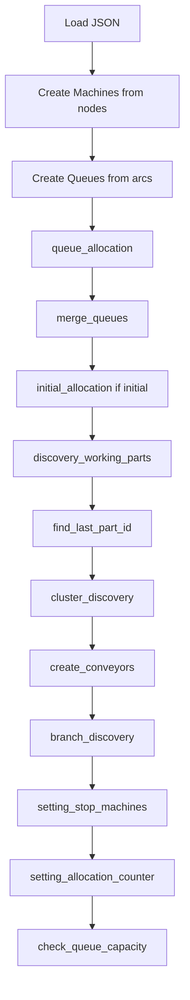
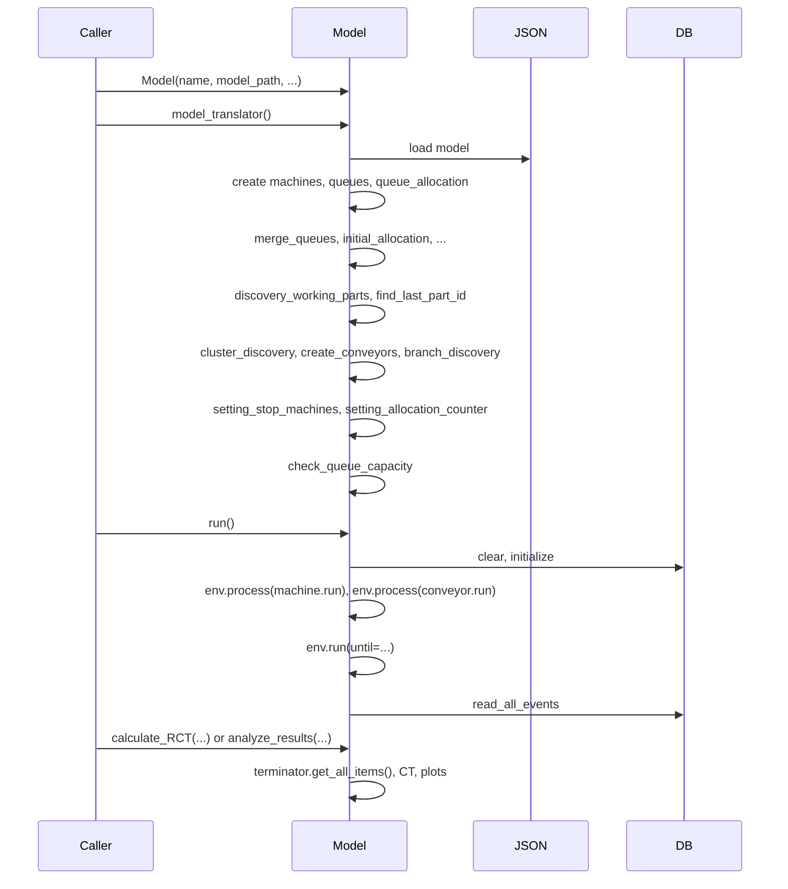

# 0003 — Report: digital_model.py — Digital Twin Model and Simulation

## 1. Purpose and role

The module **`dtwinpy/digital_model.py`** defines the **Model** class: the central object that builds and runs the discrete-event simulation of the Digital Twin. It reads the graph JSON (nodes and arcs), instantiates and wires **Machine**, **Queue**, **Conveyor**, and **Branch** components, manages initial WIP and stop conditions, runs the SimPy simulation, and provides analysis (cycle time, throughput, RCT).

**Main responsibilities:**

- **Translation:** Turn the JSON model into a runnable SimPy model (machines, queues, conveyors, branches).
- **Setup:** Queue–machine linking, merge of multiple input queues, cluster discovery, conveyor creation, branch discovery, allocation counters, initial part placement, discovery of parts already in machines.
- **Execution:** Start machine and conveyor processes, run the environment until a stop condition (time, max parts, targeted part, or exit event).
- **Persistence:** Write/read allocation counters to/from the JSON; log events to the database.
- **Analysis:** Cycle time, throughput, RCT (single part or batch), and optional plots.

---

## 2. Dependencies and imports

```python
import simpy
import json
import matplotlib.pyplot as plt
import sys

from .components import Part, Machine, Queue, Generator, Terminator, Conveyor, Branch
from .interfaceDB import Database
from .helper import Helper
```

- **simpy** — Environment, processes, event.
- **json** — Load model and read/write allocation counters.
- **matplotlib** — Plots in `analyze_results()`.
- **components** — All simulation entities.
- **interfaceDB** — Event logging (`digital_log`).
- **helper** — Logging/printing and kill.

---

## 3. Model class — overview

The **Model** is the single main class in the file. It holds the SimPy environment, the path to the model JSON, the database, stop-condition parameters, and the vectors of machines, queues, conveyors, and branches.

### 3.1 Constructor and main attributes

```python
def __init__(self, name, model_path, database_path, initial=False, until=None, part_type="A",
             loop_type="closed", maxparts=None, targeted_part_id=None, targeted_cluster=None):
```

| Attribute / param   | Description |
|---------------------|-------------|
| `name`              | Model name (e.g. for plots and logs). |
| `model_path`        | Path to the JSON model file. |
| `database_path`     | Path for the event database. |
| `initial`           | If True, load WIP from JSON `initial` and place parts in queues. |
| `until`             | SimPy run-until time (used when no exit event). |
| `part_type`         | Part type string (e.g. `"A"`). |
| `loop_type`         | `"closed"` or `"open"`. |
| `maxparts`          | Stop when this many parts have been terminated. |
| `targeted_part_id`  | Stop when this part is completed (e.g. for RCT). |
| `targeted_cluster`  | Cluster of the machine that triggers stop when it finishes the targeted part. |
| `env`               | `simpy.Environment()`. |
| `exit`              | `env.event()` — triggered to stop the run (e.g. maxparts, targeted part). |
| `Database`          | Database instance for `digital_log`. |
| `machines_vector`   | List of Machine objects. |
| `queues_vector`     | List of Queue objects (after merge, may differ from one-per-arc). |
| `conveyors_vector`  | List of Conveyor objects. |
| `branches`          | List of Branch objects (branching machines). |
| `terminator`        | Terminator instance (shared by all machines). |
| `initial_parts`     | Parts created for initial WIP. |
| `all_part_in_model` | All parts (queues + working in machines). |
| `last_part_id`      | Highest part ID in the model (for closed-loop new part creation). |

---

## 4. Model build pipeline: `model_translator()`

`model_translator()` is the main build routine. It is called once to build the simulation from the JSON. The steps below are in execution order.



### 4.1 Load JSON and create machines

- Open `model_path` and `json.load()`.
- For each `data['nodes']`, append a **Machine** with:
  - `id=node['activity']`, `process_time=node['contemp']`, `capacity`, `cluster`, `freq`,
  - `database`, `terminator`, `loop=loop_type`, `exit`, `maxparts`, `targeted_part_id`, `until`.
- Mark the last machine as final: `machines_vector[-1].set_final_machine(True)`.

### 4.2 Create queues

- For each `data['arcs']`, append a **Queue** with:
  - `id` (1-based), `arc_links=arc['arc']`, `capacity`, `freq`, `transp_time=arc['contemp']`.

### 4.3 queue_allocation()

- For each queue, read `arc_links` = `[source_activity, target_activity]`.
- Convert to 0-based indices: `arc_start = arc_links[0]-1`, `arc_end = arc_links[1]-1`.
- Add this queue to:
  - `machines_vector[arc_start].queue_out` (output of source machine),
  - `machines_vector[arc_end].queue_in` (input of target machine).

So each arc is one queue linking one machine output to one machine input.

### 4.4 merge_queues()

- For every machine that has **more than one** input queue:
  - Create a single **merged queue**: capacity = sum of capacities of those queues, same `transp_time` as the first (assumption: same transport time for all merged inputs).
  - Replace that machine’s `queue_in` with a list containing only this merged queue.
  - Update every machine’s `queue_out`: if any of its output queues was one of the merged ones, replace it with the merged queue.
- Rebuild `queues_vector` from the current machine input queues and renumber queue IDs (1-based).

Result: machines with multiple inputs (e.g. convergence) have one logical input queue; the rest of the model still references the same queue objects.

### 4.5 initial_allocation()

- Only runs if `initial == True`.
- Reads `data['initial']` (one list per queue index).
- For each queue index and each part name in that list (e.g. `"Part 27"`):
  - Parse part ID from the string.
  - Create a **Part** with that id, `part_type`, `location=queue_index`, `creation_time=0`.
  - Put the part in `queues_vector[queue_index]` and append to `all_part_in_model`.

So `initial` defines the initial WIP per queue with explicit part IDs.

### 4.6 discovery_working_parts()

- For each node in `data['nodes']` with `worked_time != 0`:
  - Build part from `worked_time` (e.g. `[time, "Part 26"]`): part ID and name.
  - Create a **Part** and assign it to the corresponding **Machine** via `set_initial_part()` and `set_worked_time()`.
  - Append the part to `all_part_in_model`.

This syncs the model with the physical state: parts already inside a machine at the start of the simulation.

### 4.7 find_last_part_id()

- Scan `all_part_in_model` for the maximum part ID.
- Set `last_part_id` on the model and call `machine.set_last_part_id(last_part_id)` for every machine (used when creating the next part in closed loop).

### 4.8 cluster_discovery()

- Assign a **cluster** index to each machine and to its output queues:
  - Machine 1: cluster 1; its output queues get cluster 2.
  - Other machines: cluster = cluster of their input queue(s); their output queues get cluster+1.

Clusters define “stages” along the process and are used for TDS (process time per cluster) and for targeted stop (e.g. by `targeted_cluster`).

### 4.9 create_conveyors()

- For each machine and each of its output queues:
  - Create a **Conveyor** with `transp_time` from that queue, and `queue_out` = that queue.
  - Append to the machine’s `conveyors_out` and to `conveyors_vector`.
- For each machine, find conveyors whose `queue_out` is this machine’s (single) input queue and set them as `conveyors_in`.

So each machine has one Conveyor per output queue; machines put parts into conveyors, and conveyors deliver to the next queue after the transport delay.

### 4.10 branch_discovery()

- For each machine with `len(conveyors_out) > 1`:
  - Create a **Branch** with that machine, its output conveyors, and its input queue(s).
  - Call `machine.set_branch(branch)` and append the branch to `branches`.

Branching machines use this object to decide which conveyor (and thus which downstream queue) to use per part (e.g. alternated or RCT).

### 4.11 setting_stop_machines()

- If `targeted_cluster` is set, for every machine in that cluster call `machine.set_stop_for_id(targeted_part_id)` so the run can stop when that part is completed at that machine.

### 4.12 setting_allocation_counter()

- For each branch, read the corresponding node’s `allocation_counter` from the JSON and call `machine.set_allocation_counter(...)` so the alternated policy continues from the last run (e.g. after sync).

### 4.13 check_queue_capacity()

- For each queue index in `initial`, compare number of parts assigned there with the queue’s capacity.
- If any queue is over capacity, log an error and exit (e.g. `sys.exit()`).

---

## 5. Run pipeline: `run()`

```python
def run(self):
    # 1) Clear and initialize event table
    self.Database.clear(self.event_table)
    self.Database.initialize(self.event_table)

    # 2) Start all machine and conveyor processes
    for machine in self.machines_vector:
        self.env.process(machine.run())
    for conveyor in self.conveyors_vector:
        self.env.process(conveyor.run())

    # 3) Run until stop condition
    if self.loop_type == "closed":
        if self.maxparts is not None or self.targeted_part_id is not None:
            self.env.run(until=self.exit)   # stop on event
        else:
            self.env.run(until=self.until)  # stop on time
    elif self.loop_type == "open":
        self.env.run(until=self.exit)

    # 4) Optional: read back events
    self.Database.read_all_events(self.event_table)
```

- **Closed loop:** Either run until `exit` is triggered (e.g. maxparts or targeted part) or until `until` (time).
- **Open loop:** Run until `exit` (e.g. when the last part leaves the line).
- Machines and conveyors run as SimPy processes; they interact via queues and conveyors and eventually trigger `exit.succeed()` when the stop condition is met.

---

## 6. Setting helpers (pre/post simulation)

| Method | When / purpose |
|--------|-----------------|
| **queue_allocation()** | During build: link queues to machines by arc. |
| **initial_allocation()** | During build (if `initial`): place WIP in queues. |
| **check_queue_capacity()** | After build: abort if initial WIP exceeds queue capacity. |
| **discovery_working_parts()** | During build: set `initial_part` and `worked_time` on machines from JSON. |
| **find_last_part_id()** | During build: set `last_part_id` on model and machines. |
| **merge_queues()** | During build: merge multiple input queues per machine. |
| **cluster_discovery()** | During build: assign cluster to machines and queues. |
| **create_conveyors()** | During build: create conveyors and assign to machines. |
| **branch_discovery()** | During build: create Branch objects for machines with multiple outputs. |
| **setting_stop_machines()** | During build: set targeted part stop on the right cluster. |
| **setting_allocation_counter()** | During build: load allocation counters from JSON into branching machines. |
| **changing_allocation_counter()** | After run: write back allocation counters from machines to JSON (currently commented out in `run()`). |

---

## 7. Analysis and RCT

### 7.1 analyze_results(options)

- Gets terminated parts from the terminator.
- If there are enough parts (e.g. ≥ 3):
  - Sorts by part ID, computes finish/creation times.
  - **Lead time plot:** part ID vs finish time.
  - **Throughput:** number of parts / total time.
  - **Cycle time:** per-part CT, max/min/avg, and cycle time vs part ID plot.
- Uses matplotlib; can save figures under `figures/`.

### 7.2 calculate_RCT(part_id_selected, batch)

- **Single part:** `part_id_selected` set, `batch` None → search terminator for that part, return its cycle time (RCT).
- **Batch:** `batch` = number of parts → take the first `batch` parts from the terminator (in completion order), return the cycle time of the last one (RCT for that batch).

### 7.3 calculate_Batch_RCT(batch_vector, verbose)

- **Input:** `batch_vector` = list of part names (e.g. `['Part 1', 'Part 3', 'Part 2']`).
- Finds those parts in the terminator.
- RCT = `max(termination_time) - min(creation_time)` over the batch.
- If `verbose`, prints first/last part and batch RCT.

---

## 8. Getters and setters (selection)

| Method | Returns / effect |
|--------|-------------------|
| **get_model_components()** | `(machines_vector, queues_vector)`. |
| **get_model_database()** | Database instance. |
| **get_model_path()** | Path to JSON model. |
| **get_branches()** | List of Branch objects. |
| **get_all_parts()** | Parts currently in any queue. |
| **get_working_parts()** | Parts currently in machines (`initial_part`). |
| **get_terminated_parts()** | Parts in the terminator. |
| **get_parts_CT_ordered()** | `(parts_finished_id, parts_cycle_time)` sorted by ID. |
| **get_model_constrains()** | `(until, maxparts, targeted_part_id, targeted_cluster)`. |
| **get_selected_machine(machine_name, machine_id)** | Machine matching name or id. |
| **check_partID_in_simulation(part_id)** | True if that part is in queues or in a machine. |
| **set_targeted_part_id / set_targeted_cluster / set_until** | Update stop-condition parameters. |

---

## 9. High-level flow: JSON → run → analysis



---

## 10. Relation to other modules

| Module / concept | Relation to digital_model |
|------------------|----------------------------|
| **components** | Model builds and holds Machine, Queue, Conveyor, Branch, Part; uses Generator logic in initial_allocation; all machines share one Terminator. |
| **models (JSON)** | model_path points to JSON; model_translator reads nodes/arcs/initial/worked_time/allocation_counter; changing_allocation_counter writes allocation_counter back. |
| **interfaceDB** | Database used for `digital_log` (clear, initialize, write_event in components, read_all_events). |
| **services** | Higher-level services (e.g. RCT) typically create a Model, call model_translator(), optionally set parts_branch_queue or branching_path, then run() and call calculate_RCT or get_terminated_parts. |

---

## 11. Summary

- **digital_model.py** provides the **Model** class: load graph from JSON, build machines/queues/conveyors/branches, set WIP and working parts, then run the SimPy simulation and analyze results.
- **model_translator()** implements the full build pipeline: create machines and queues, link them, merge multi-input queues, assign initial and in-machine parts, discover clusters and branches, create conveyors, set stop conditions and allocation counters, and check capacities.
- **run()** starts machine and conveyor processes and runs the environment until a time or event-based stop condition.
- **Analysis** includes cycle time, throughput, plots, single-part RCT, and batch RCT; getters expose components, parts, and constraints for use by services and sync/update logic.
