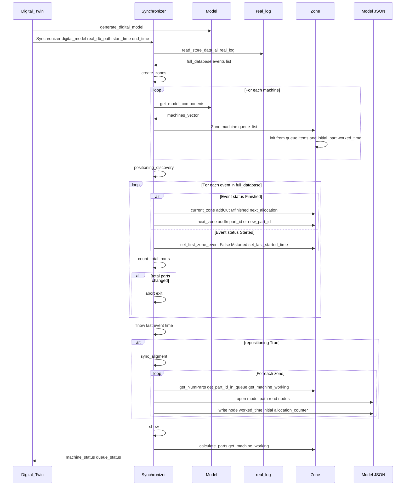
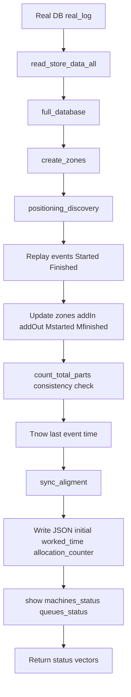

# 0004 — Report: synchronizer.py — Physical–Digital Synchronization

## 1. Purpose and role

The module **`dtwinpy/synchronizer.py`** implements **synchronization** between the **physical world** (real event log) and the **digital model** (JSON + SimPy simulation). It replays real events to infer where every part is at the end of the log (which queue, which machine), then **writes that state back into the model JSON** so the next simulation run starts from the real-world state.

**Main responsibilities:**

- **Zone** — Represent one machine plus its input queue(s); track parts “in zone” (in queue or in machine) via event replay.
- **Synchronizer** — Load real log (time window), create one zone per machine, replay events to update zone counters and part lists, then align the digital model (update `initial`, `worked_time`, `allocation_counter` in the JSON).

**Assumption (stated in code):** No parts are added or removed from the system during the sync window; part count must stay constant or the sync aborts.

---

## 2. Dependencies and imports

```python
from .validator import Validator
from .interfaceDB import Database
from .helper import Helper
import json
import sqlite3
import sys
```

- **Validator** — Used optionally for TDS (Trace Driven Simulation) during sync (`sync_TDS()`).
- **Database** — Read real events from `real_log` (with start/end time and optional copy).
- **Helper** — Logging and error reporting.

---

## 3. Zone class — one machine + its input queue(s)

A **Zone** is the unit of tracking: one **machine** plus the list of **queues** that feed it (typically one after `merge_queues`, but the code supports multiple).

### 3.1 Role

- Count how many parts **entered** the zone (`inZone`) and how many **left** (`outZone`).
- Maintain **initial** count (`Zone_initial`) and **current** count (`NumParts = Zone_initial + inZone - outZone`).
- Keep **lists of part IDs** in queue and in machine: `parts_ids_in_queue`, `parts_ids_in_machine`.
- Track whether the machine is **working** (`machine_working`, 0 or 1) and **last started time** for `worked_time` in the JSON.
- For **branching machines**, compute **next allocation** (which output queue will get the next part) for the alternated policy.

### 3.2 Constructor and initial conditions

```python
def __init__(self, machine, queue_list, digital_model=None):
```

- **machine** — The Machine object for this zone.
- **queue_list** — List of Queue objects that are inputs to this machine (usually `machine.get_queue_in()`).
- **digital_model** — Used to read the model path for JSON checks.

**Initialization logic:**

1. **Queues:** For each queue in `queue_list`, add its current length to `Zone_initial` and copy part names from `queue.get_all_items()` into `parts_ids_in_queue`.
2. **Machine:** If `machine.get_initial_part()` is not None (part already in machine at “sync start”):
   - Add that part to `parts_ids_in_machine`, set `machine_working = 1`, `last_started_time = machine.get_worked_time()`, `flag_initial_working = True`, and increment `Zone_initial`.
3. **Validation:** Call `check_inital_working_machine()` to compare with the JSON `worked_time` and flag inconsistencies.

### 3.3 Event-driven updates

| Method | When / effect |
|--------|----------------|
| **addIn(part_id)** | A part entered the zone (e.g. from previous machine). Increments `inZone`, appends `part_id` to `parts_ids_in_queue`. |
| **addOut(part_id)** | A part left the zone (finished and sent to next zone). Increments `outZone`. |
| **Mstarted(part_id)** | Machine **started** processing this part. Increments `machine_working`, appends to `parts_ids_in_machine`, **removes** from `parts_ids_in_queue` (part left queue and entered machine). |
| **Mfinished(part_id)** | Machine **finished** this part. Decrements `machine_working`, removes from `parts_ids_in_machine`. Clears `flag_initial_working` if it was the initial part. |
| **next_allocation(queue_allocated)** | For branching machines only: given the queue name where the part was just sent, compute the **next** queue index for the alternated policy and store in `next_queue_position`. |

### 3.4 Counts and validation

- **calculate_parts()** — `NumParts = Zone_initial + inZone - outZone`; returns current number of parts in the zone.
- **self_validation(Verbose)** — Counts parts in the zone **from the digital model**: sum of queue lengths + 1 if machine is working + parts in conveyors delivering to this machine. Returns that count (and optionally prints it). Used to compare “digital” vs “real” after replay.
- **check_inital_working_machine()** — Reads JSON `worked_time` for this machine; if it is non-zero but the zone thinks no part is in the machine, prints an error.

### 3.5 Getters / setters (selection)

- **get_name()**, **get_id()** (zoneID = machine id), **get_queue_list()**, **get_machine()**
- **get_NumParts()**, **get_Zone_initial()**, **get_last_started_time()**, **get_machine_working()**
- **get_part_id_in_queue()**, **get_part_id_in_machine()**, **get_flag_initial_working()**
- **get_first_zone_event()**, **get_allocation_counter()** (next_queue_position for branching)
- **set_zoneInd()**, **set_last_started_time()**, **set_first_zone_event()**, **set_event_type()**, **set_Zone_initial()**

---

## 4. Synchronizer class — main sync flow

### 4.1 Constructor

```python
def __init__(self, digital_model, real_database_path, start_time, end_time, generate_digital_model,
             copied_realDB=False, delta_t_treshold=100):
```

| Parameter / attribute | Description |
|-----------------------|-------------|
| **digital_model** | The Model instance (already built; used to get machines, queues, model path). |
| **real_database_path** | Path to the database containing the real event log. |
| **start_time**, **end_time** | Event ID range (or time range) for which to read real events. |
| **generate_digital_model** | Flag (e.g. for Validator/TDS). |
| **copied_realDB** | Whether the DB is a copy (affects Database behaviour). |
| **delta_t_treshold** | Passed to Validator (e.g. TDS). |
| **real_database** | Database instance with `event_table="real_log"`, feature `sync`, and time window. |
| **full_database** | Result of `read_store_data_all("real_log")` — list of events in the window. |
| **zones_dict** | Dict: machine_name → Zone. |
| **Tnow** | Time of the last event in the replayed log (set after positioning_discovery). |
| **last_part_id** | From the last machine (for creating new part IDs when the final machine finishes a part). |

### 4.2 create_zones()

- For each machine in `digital_model.get_model_components()` machines:
  - Build a **Zone** with that machine and `machine.get_queue_in()`.
  - Store it in `zones_dict[machine.get_name()]`.

So there is exactly one zone per machine; each zone’s “queue list” is that machine’s input queue(s) (after merge, usually one).

### 4.3 count_total_parts()

- Sum over all zones: `len(zone.get_part_id_in_queue()) + len(zone.get_part_id_in_machine())`.
- Used to check that the total number of parts in the system does not change during replay (no external add/remove).

### 4.4 positioning_discovery()

Replays the **real log** event by event and updates zones so that, at the end, each zone’s lists reflect where every part is.

**Event format (from `full_database`):** each row is unpacked as:

- `(time, machine_name, status, part_id, queue_name) = (event[0], event[1], event[2], event[3], event[4])`

**Logic:**

1. **Finished** (part left the machine):
   - **Current zone:** `addOut(part_id)`, `Mfinished(part_id)`, `next_allocation(queue_name)`.
   - **Next zone:** Find the zone that has a queue with `queue.get_name() == queue_name`.
     - If the machine is **final**: create new part ID `last_part_id += 1`, `new_part_id = "Part {id}"`, and `next_zone.addIn(new_part_id)`.
     - Else: `next_zone.addIn(part_id)` (same part moved to next zone).

2. **Started** (machine took a part from queue and started processing):
   - `current_zone.set_first_zone_event(False)`.
   - `current_zone.Mstarted(part_id)` (part leaves queue, enters machine).
   - `current_zone.set_last_started_time(time)`.
   - `current_zone.set_event_type("Started")`.

3. After each event, **count_total_parts()** is compared to the previous total; if it changes, the sync aborts with an error (parts added or removed).

4. At the end, **Tnow** is set to the time of the last event: `self.Tnow = self.full_database[-1][0]`.

So after `positioning_discovery()`, each zone has the correct `parts_ids_in_queue`, `parts_ids_in_machine`, `machine_working`, `last_started_time`, and (for branching) `next_queue_position`.

### 4.5 sync_TDS() (optional)

- Creates a **Validator** in TDS mode with the same real DB and time window.
- Sets that validator on every machine, calls `validator_sync.allocate()` and `validator_sync.run()`.
- Currently **not** called from `run()` (commented / disabled).

### 4.6 sync_indicator()

- For each zone:
  - **NumParts_real** = `zone.calculate_parts()` (from replayed events).
  - **NumParts_digital** = `zone.self_validation(Verbose=False)` (from current digital state).
  - Computes an error and `syncInd = 1 - error`, then `zone.set_zoneInd(syncInd)`.
- Used to measure how well the digital state matches the inferred real state (currently not called in `run()`).

### 4.7 sync_aligment()

Writes the replayed state **back into the model JSON** so the digital model matches the physical state.

**Per zone:**

1. **Worked time and part in machine**
   - If the machine is working: compute **Delta_T_started**:
     - If `flag_initial_working`: `Delta_T_started = Tnow + last_started_time` (interpretation: time already spent before sync window).
     - Else: `Delta_T_started = Tnow - last_started_time` (time since part started in the window).
   - Avoid 0: if `Delta_T_started == 0` then set to 1.
   - In the JSON, set for this node: `node['worked_time'] = (Delta_T_started, parts_id_in_machine)` (tuple: time and part name).
   - If the machine is not working: set `node['worked_time'] = 0`.

2. **Parts in queues (initial)**
   - For each input queue of the zone, the code assigns `data['initial'][queue.get_id() - 1]` to the list of part IDs that belong in that queue (`parts_id_in_queues`). If there are more parts than one queue capacity, it fills one queue and carries the rest to the next (merged queues case); otherwise it assigns the list and breaks.

3. **Allocation counter (branching)**
   - If the zone has `next_queue_position` set (from `next_allocation`), write it to the JSON: `node['allocation_counter'] = current_allocation_counter` for the corresponding machine.

So after `sync_aligment()`, the JSON has:

- **nodes[].worked_time** — Either 0 or `(delta_t, "Part N")` for the part currently in the machine.
- **initial[]** — Per-queue list of part names (e.g. `["Part 1", "Part 2"]`) in that queue.
- **nodes[].allocation_counter** — Next output queue index for branching machines.

### 4.8 show()

- For each zone: `zone.calculate_parts()`, `zone.get_machine_working()`, `zone.get_zoneInd()`.
- Builds two lists: **machines_status** (machine working: True/False per zone), **queues_status** (NumParts per zone).
- Returns `(machines_status, queues_status)`.

### 4.9 run(repositioning=True)

Main entry point:

1. **create_zones()**
2. **positioning_discovery()** — Replay real log and update zone state.
3. Optionally **sync_TDS()** (currently commented out).
4. Optionally **sync_indicator()** (currently commented out).
5. If **repositioning**: **sync_aligment()** — Write state to JSON.
6. **show()** — Compute and return status vectors.
7. Returns **(machine_status, queue_status)**.

So in the default configuration, the synchronizer: creates zones, replays events to infer part positions, writes `initial` / `worked_time` / `allocation_counter` into the model JSON, and returns machine/queue status vectors.

---

## 5. Step-by-step: how synchronization works

### 5.1 Why event replay?

The **physical system** writes events (Started, Finished) to **real_log**. We do not have a live “snapshot” of where each part is. The synchronizer **replays** those events in order and updates **zones** (one per machine: queue + machine) so that at the **end** of the window we know exactly which part is in which queue and which part (if any) is inside each machine, plus how long it has been there.

### 5.2 Step-by-step flow of run()

| Step | Who | Action |
|------|-----|--------|
| 1 | Synchronizer | **create_zones()**: for each machine, build a **Zone**(machine, machine.get_queue_in()) and store in **zones_dict**. Each zone is initialized from current queue contents and **machine.get_initial_part()** / **worked_time**. |
| 2 | Synchronizer | Load **full_database** = real_database.read_store_data_all("real_log") for the time window [start_time, end_time]. |
| 3 | Synchronizer | **positioning_discovery()**: for **each event** in **full_database** (in order): |
| 4 | — | If **status == "Finished"**: current zone **addOut(part_id)**, **Mfinished(part_id)**; find **next_zone** by queue_name; if final machine create **new_part_id** and **next_zone.addIn(new_part_id)**, else **next_zone.addIn(part_id)**; **next_allocation(queue_name)** for branching. |
| 5 | — | If **status == "Started"**: **set_first_zone_event(False)**; current zone **Mstarted(part_id)** (part leaves queue, enters machine), **set_last_started_time(time)**. |
| 6 | — | After each event, **count_total_parts()**; if total changed vs previous, **abort** (parts added/removed). |
| 7 | Synchronizer | Set **Tnow** = time of last event in full_database. |
| 8 | Synchronizer | If **repositioning**: **sync_aligment()** — for each zone, compute **worked_time** (0 or (Delta_T, part_id)) and **parts in queues**; write **JSON**: nodes[].worked_time, initial[], nodes[].allocation_counter. |
| 9 | Synchronizer | **show()**: for each zone **calculate_parts()** and **get_machine_working()**; return **(machines_status, queues_status)**. |

So: **one pass** over the real log updates all zones; **one pass** over zones writes the JSON. The next time the digital model is built from that JSON, it starts with the same WIP and same part in each machine (with correct remaining time).

---

## 6. Sequence diagram — Synchronizer run()



---

## 7. High-level flow (Mermaid)



---

## 8. Event replay logic (summary)

| Real event | Zone update |
|------------|-------------|
| **Finished** (machine, part_id, queue_name) | Current zone: part leaves machine (addOut, Mfinished). Next zone (by queue_name): part enters (addIn); if final machine, create new part and addIn that. Update next_allocation for branching. |
| **Started** (machine, part_id) | Current zone: part leaves queue and enters machine (Mstarted), set last_started_time, set_first_zone_event(False). |

The replay **order** is the order of events in the real log (by event ID / time). So the “positioning” is the state at the **end** of the window, after all those events have been applied.

---

## 9. Relation to other modules

| Module / concept | Relation to synchronizer |
|-------------------|--------------------------|
| **digital_model** | Synchronizer receives the built Model; uses `get_model_components()`, `get_model_path()`; writes to the same JSON file the model reads (initial, worked_time, allocation_counter). |
| **interfaceDB** | Database with `real_log` and time window; `read_store_data_all("real_log")` returns the event list for replay. |
| **validator** | Optional TDS run during sync (`sync_TDS()`); not used in default `run()`. |
| **Model JSON** | After sync_aligment, the model JSON is updated so that the next `model_translator()` + `run()` starts from the physical state (same WIP and same part in machine with correct worked_time). |

---

## 10. Summary

- **synchronizer.py** aligns the digital twin with the physical system by replaying the **real_log** and then writing the inferred state to the **model JSON**.
- **Zone** = one machine + its input queue(s); it tracks part IDs in queue and in machine, in/out counts, and (for branching) next allocation; it is updated by **Started** and **Finished** events.
- **Synchronizer** creates one zone per machine, runs **positioning_discovery()** to replay events and update zones, then **sync_aligment()** to set `initial`, `worked_time`, and `allocation_counter` in the JSON.
- **run()** returns machine and queue status vectors; with **repositioning=True** (default), the JSON is updated so the next simulation run starts from the synchronized state.
