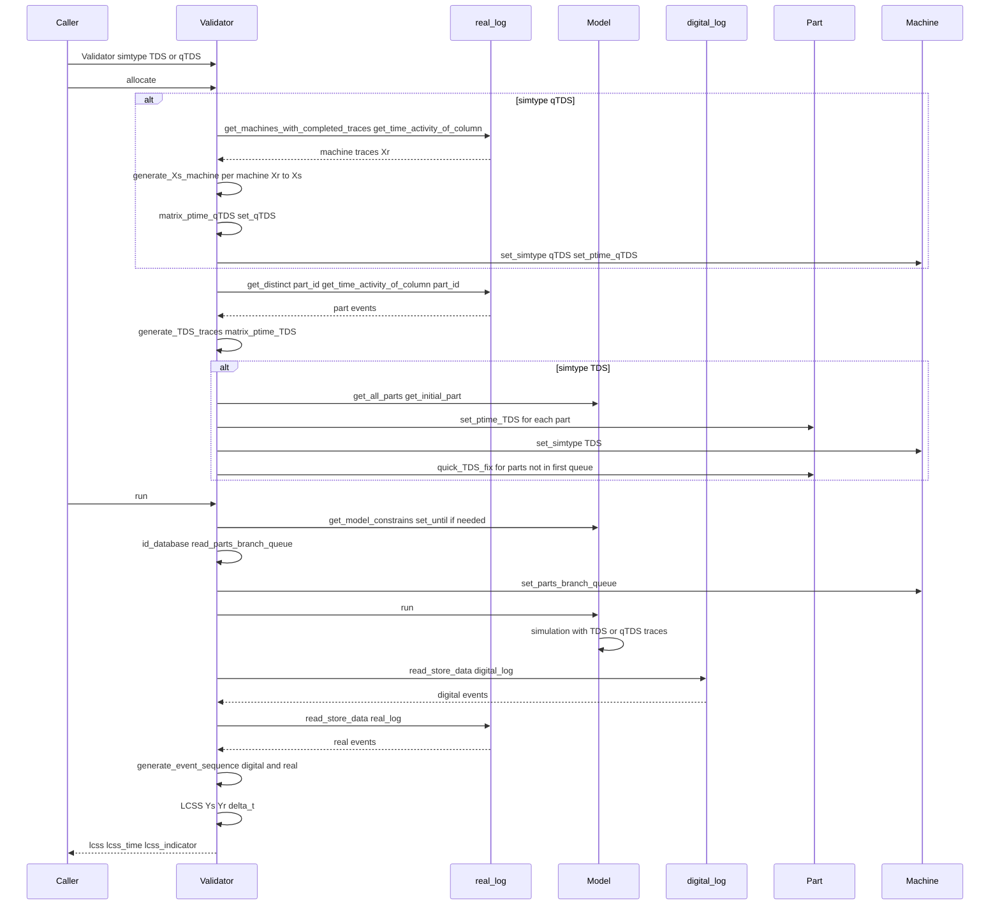
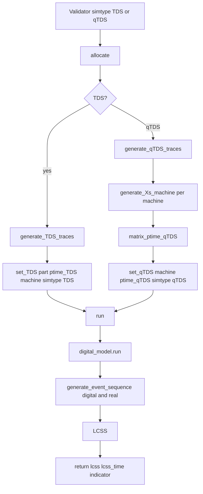

# 0005 — Report: validator.py — Trace-Driven and Quasi Trace-Driven Validation

## 1. Purpose and role

The module **`dtwinpy/validator.py`** implements **validation** of the digital twin against the **real event log**. It supports two modes:

- **TDS (Trace Driven Simulation):** Use **exact** process times from the real log **per part and per cluster**. The digital model runs with those traces; then event sequences (real vs digital) are compared to assess **logic** (routing, order).
- **qTDS (quasi Trace Driven Simulation):** Use process times from the real log **per machine** to derive a **correlated** synthetic trace that respects the digital model’s **distribution** (e.g. normal). The digital model runs with those synthetic traces; then event sequences are compared to assess **input** (distribution) validity.

In both cases, comparison is done via **LCSS** (Longest Common Subsequence) with a time threshold **delta_t**, producing a similarity **indicator** (0–1).

---

## 2. Dependencies and imports

```python
from .interfaceDB import Database
from .helper import Helper
import numpy as np
import matplotlib.pyplot as plt
import sqlite3
```

- **Database** — Read real log (`real_log`) and digital log (`digital_log`); optional ID/branch-queue DB.
- **Helper** — Logging and errors.
- **numpy** — ECDF, arrays in `generate_Xs_machine` and **dDTW**.
- **matplotlib** — Optional plots in `generate_Xs_machine`.
- **sqlite3** — Check/rename table (digital_log → real_log) when the DB only has a digital table.

---

## 3. Validator class — overview

Single class **Validator**; no separate subclasses. Main attributes and flow:

- **simtype:** `"TDS"` or `"qTDS"`.
- **matrix_ptime_TDS:** dict `part_name → [process_time per cluster]` (TDS).
- **matrix_ptime_qTDS:** dict `machine_name → array of process times` (qTDS, synthetic).
- **real_database** / **digital_database** — Real and digital event DBs.
- **allocate()** — Build traces (TDS and/or qTDS) and assign them to parts/machines.
- **run()** — Optionally set simulation duration, set branch routing from ID DB, run the digital model, then compare event sequences with LCSS and return the indicator.

---

## 4. Constructor and main attributes

```python
def __init__(self, digital_model, simtype, real_database_path, start_time, end_time,
             generate_digital_model, id_database_path=False, copied_realDB=False,
             delta_t_treshold=100, plot=False):
```

| Parameter / attribute | Description |
|----------------------|-------------|
| **digital_model** | Model instance (already built); used to get components and run simulation. |
| **simtype** | `"TDS"` or `"qTDS"`. |
| **real_database_path** | Path to DB containing `real_log`. |
| **start_time**, **end_time** | Time/event window for reading real log. |
| **generate_digital_model** | Flag (e.g. for generating a new model; not used to rebuild inside validator). |
| **id_database_path** | Optional path to DB with branch routing (`read_parts_branch_queue`); can be False. |
| **copied_realDB** | Whether the real DB is a copy (passed to Database). |
| **delta_t_treshold** | Time tolerance (e.g. 100) for LCSS: two events match if type is same and time difference ≤ delta_t. |
| **plot** | If True, plot in `generate_Xs_machine`. |
| **real_database** | Database with `event_table="real_log"`, feature `valid_logic` (TDS) or `valid_input` (qTDS). |
| **digital_database** | From `digital_model.get_model_database()` (digital_log). |
| **id_database** | Database with `event_table="ID"` for `read_parts_branch_queue()`. |
| **machines_vector**, **queues_vector** | From `digital_model.get_model_components()`. |

On init, if the DB has only a table named `digital_log`, it is renamed to `real_log` so the validator can read it as the “real” log.

---

## 5. TDS (Trace Driven Simulation)

### 5.1 Idea

- Extract from the **real log** the **process time per machine (cluster)** for **each part** (Started → Finished pairs).
- Assign that list to the corresponding **Part** as **ptime_TDS**.
- Set all machines to **simtype = "TDS"**. When a part is processed, the **Machine** uses `part.get_ptime_TDS(cluster)` instead of sampling from a distribution.
- So the digital run **replays exact real process times**; comparison then measures **logic** (order, routing) rather than input randomness.

### 5.2 generate_TDS_traces()

- Gets distinct **part_id** from `real_log` (sorted by part number).
- For each part: **get_time_activity_of_column(column="part_id", ...)** → list of events `(time, activity_type)` (Started/Finished).
- For each consecutive Started–Finished pair: **process_time = finished_time - started_time**; append to that part’s trace.
- Special case: if there is a Finished without a preceding Started (e.g. part already in machine at window start), use **finished_time** as the single process time for that step.
- Returns a **dict**: `part_name → [process_time for cluster 1, cluster 2, ...]`.

So the trace length = number of machines (clusters) the part visited in the window.

### 5.3 set_TDS()

- Collect all parts: from every queue (`get_all_items`) and every machine (`get_initial_part()`).
- For each part, **get_part_TDS(part)** from **matrix_ptime_TDS** and **part.set_ptime_TDS(...)**.
- Set **machine.set_simtype("TDS")** for all machines.
- **Filter parts:** keep only parts that appear in **get_parts_with_completed_traces()** (parts that have a full trace in the real log); remove others from the “initial parts” list and optionally print a warning.
- For parts **in a queue** (not in the first queue): infer **part queue** and **cluster**; call **part.quick_TDS_fix(part_cluster)** to pad the trace with zeros for clusters already passed (so cluster index aligns with trace index).

Result: every part that stays in the validation has a TDS trace; machines run in TDS mode; parts starting mid-flow have aligned trace indices.

### 5.4 get_part_TDS(part) / get_len_TDS()

- **get_part_TDS(part):** returns `matrix_ptime_TDS[part.get_name()]`; on KeyError, warning.
- **get_len_TDS():** returns `len(matrix_ptime_TDS)` (number of parts with TDS traces).

---

## 6. qTDS (quasi Trace Driven Simulation)

### 6.1 Idea

- Extract from the **real log** the **process times per machine** (each Started–Finished pair gives one time).
- For machines with a **distribution** (e.g. `["norm", μ, σ]`), use **ECDF** of real times (Xr) to get “randomness” **u**, then **inverse transform** (e.g. `norm.ppf(u, μ, σ)`) to get **synthetic** times **Xs** that follow the digital distribution but preserve the rank structure of Xr.
- Assign **Xs** to the machine as **ptime_qTDS**; set **simtype = "qTDS"**. The machine then uses these values in order instead of sampling.
- So the digital run uses **correlated synthetic** process times; comparison assesses how well the **input distribution** and structure match the real behaviour.

### 6.2 generate_qTDS_traces()

- Gets distinct **machine_id** from `real_log`.
- For each machine: **get_time_activity_of_column(column="machine_id", ...)** → list of (time, activity_type).
- For each Started–Finished pair: **processed_time = finished_time - started_time**; append to that machine’s trace.
- Returns **dict**: `machine_name → [process_time_1, process_time_2, ...]`.

### 6.3 generate_Xs_machine(loc, scale, distribution, Xr, a=None, b=None)

- **Xr** = real process times (e.g. one machine’s trace).
- **ECDF(Xr):** sorted Xr, ecdf = (1..n)/n.
- **randomness(u):** for each Xr value, find its rank in sorted Xr and take the corresponding ecdf value; if any u is 1.0, replace with **umax** (tuned in a loop 0.91–0.99) to avoid infinity in **dist.ppf**.
- **dist** = scipy distribution by name: `norm`, `expon`, `gamma`, `erlang`, `weibull_min`, `weibull_max`, `triang`, `lognorm`, `beta` (with N_Parameter 2, 3, or 4).
- **Xs = dist.ppf(u, loc, scale)** (or with a, b for 3/4-parameter dists).
- Loop over **umax** values to reduce error on the maximum value; when error increases, keep previous Xs and break.
- Optional **plot**: Xr vs Xs.
- Returns **Xs** (numpy array).

So Xs has the same “randomness” (rank order) as Xr but follows the digital model’s distribution.

### 6.4 set_qTDS()

- Gets **get_machines_with_completed_traces()** (machines that have full traces in the real log).
- For each such machine in **machines_vector**:
  - If **process_time** is a list (distribution): set **simtype = "qTDS"** and **set_ptime_qTDS(matrix_ptime_qTDS[machine_name])**.
  - If deterministic (not a list): no assignment (no qTDS for that machine).

---

## 7. allocate() — build and assign traces

**Order of operations:**

1. **qTDS branch**
   - **generate_qTDS_traces()** → Xr matrix (machine → list of real process times).
   - For each machine in **get_machines_with_completed_traces()** that has a **distribution** (list) process_time:
     - **generate_Xs_machine(loc, scale, distribution, Xr_vector)** → Xs_vector.
     - Store in **matrix_ptime_qTDS[machine_name] = Xs_vector**.
   - **set_qTDS()** — assign to machines and set simtype.

2. **TDS branch**
   - **generate_TDS_traces()** → **matrix_ptime_TDS** (part_name → list of process times per cluster).
   - If **simtype == "TDS"**: **set_TDS()** — assign to parts and set machine simtype.

3. **Print** both matrices (for debugging).

So **allocate()** always builds both TDS and qTDS matrices; then either **set_TDS()** or **set_qTDS()** is applied depending on **simtype**. Typical use: call **allocate()** once, then **run()**.

---

## 8. Event sequence and LCSS comparison

### 8.1 generate_event_sequence(database, table)

- **database.read_store_data(table)** → list of events (e.g. each row = time, machine_id, activity_type, ...).
- **time_sequence** = list of event[0].
- **events_sequence** = list of strings `event[1] + " - " + event[2]` (e.g. `"Machine 2 - Finished"`).
- Returns **(time_sequence, events_sequence)**.

### 8.2 LCSS(Sequence1, Sequence1_time, Sequence2, Sequence2_time, delta_t, order=False)

- **Longest Common Subsequence** with **time threshold**: two events match if they have the **same label** and **|time1 − time2| ≤ delta_t**.
- If **Sequence1** is longer than **Sequence2**, swap so the **shorter** is first (keeps indicator ≤ 1).
- Loop over Sequence1; for each event, find the first matching event in Sequence2 (from **jstart**). If **order=True**, advance **jstart** so order is preserved.
- **indicator = len(lcss) / max(len(Seq1), len(Seq2))**.
- Returns **(lcss, lcss_time, indicator)**.

So the indicator is the fraction of events (in the longer sequence) that can be matched in the other with the same type and within **delta_t** time.

### 8.3 dDTW(s1, s2)

- **Static** method (no self): **Dynamic Time Warping** distance on two numeric sequences.
- Normalizes by max of both; builds cost matrix; **dDTW_bar = d[n,m] / max(n,m)**; returns **1 - dDTW_bar** as a “validity index” (1 = identical).
- Not used in the main **run()** path; available for alternative comparison.

---

## 9. run() — execute validation

1. **Stop conditions**
   - Get **(until, maxparts, targeted_part_id, targeted_cluster)** from **digital_model.get_model_constrains()**.
   - If all are None and **start_time / end_time** are set: set **until = real_database.get_current_durantion() + 1** and **digital_model.set_until(until)** so the simulation runs for the duration of the real trace.

2. **Branch routing**
   - **parts_branch_queue = id_database.read_parts_branch_queue()** (if ID DB was provided).
   - **machine.set_parts_branch_queue(parts_branch_queue)** for all machines (so RCT/branch decisions match the scenario to validate).

3. **TDS**
   - **digital_model.run()** (digital run with TDS traces).
   - **generate_event_sequence(digital_database, "digital_log")** → (Ys_time, Ys_event).
   - **generate_event_sequence(real_database, "real_log")** → (Yr_time, Yr_event).
   - **LCSS(Ys_event, Ys_time, Yr_event, Yr_time, delta_t_treshold)** → (lcss, lcss_time, lcss_indicator).
   - Print “LOGIC VALIDATION” and real vs digital sequences and indicator.
   - **Return (lcss, lcss_time, lcss_indicator)**.

4. **qTDS**
   - Same as TDS but labelled “INPUT VALIDATION”; same return format.

So **run()** assumes **allocate()** was already called (so parts/machines have TDS or qTDS data), then runs the model once and returns the LCSS result.

---

## 10. Step-by-step: how validation works

### 10.1 Why two runs (allocate then run)?

- **allocate()** builds **traces** from the **real log** (process times per part per cluster for TDS, or per machine for qTDS) and **assigns** them to the digital model’s parts/machines. It does **not** run the simulation.
- **run()** runs the **digital simulation** once with those traces, then reads the **digital_log** and compares it to the **real_log** (event sequences) via **LCSS**. So: first we “feed” the model with real data (allocate), then we run and compare outputs (run).

### 10.2 Step-by-step flow for TDS (logic validation)

| Step | Who | Action |
|------|-----|--------|
| 1 | Caller | Create **Validator**(digital_model, simtype="TDS", real_database_path, start_time, end_time, ...). |
| 2 | Caller | **allocate()**: **generate_TDS_traces()** from real_log (per part, Started–Finished pairs → process times per cluster) → **matrix_ptime_TDS**. |
| 3 | Validator | **set_TDS()**: for each part in queues and in machines, **part.set_ptime_TDS**(trace); **machine.set_simtype("TDS")**; filter parts to those with completed traces; for parts not in first queue, **part.quick_TDS_fix**(cluster). |
| 4 | Caller | **run()**: get model constraints; if until is None, set **until** from real_database.get_current_durantion(); **machine.set_parts_branch_queue**(from ID DB). |
| 5 | Validator | **digital_model.run()** — simulation uses **part.get_ptime_TDS(cluster)** instead of sampling. |
| 6 | Validator | **generate_event_sequence**(digital_database, "digital_log") → (Ys_time, Ys_event); **generate_event_sequence**(real_database, "real_log") → (Yr_time, Yr_event). |
| 7 | Validator | **LCSS**(Ys_event, Ys_time, Yr_event, Yr_time, delta_t) → (lcss, lcss_time, **lcss_indicator**). |
| 8 | Validator | Return **(lcss, lcss_time, lcss_indicator)**. |

### 10.3 Step-by-step flow for qTDS (input validation)

| Step | Who | Action |
|------|-----|--------|
| 1 | Caller | Create **Validator**(simtype="qTDS", ...). |
| 2 | Caller | **allocate()**: **generate_qTDS_traces()** (per machine, Started–Finished → process times); for each machine with distribution, **generate_Xs_machine**(Xr) → Xs; **matrix_ptime_qTDS**; **set_qTDS()** (assign to machines, simtype qTDS). |
| 3 | Caller | **run()**: same as TDS — **digital_model.run()** (machines use **ptime_qTDS** in order); **generate_event_sequence** digital and real; **LCSS**; return indicator. |

So **allocate()** = build and assign traces; **run()** = one simulation + event comparison. The **indicator** is the fraction of events that match (same type, within delta_t).

---

## 11. Sequence diagram — Validator allocate() and run()



---

## 12. High-level flow (Mermaid)



---

## 13. Relation to other modules

| Module / concept | Relation to validator |
|-------------------|------------------------|
| **digital_model** | Provides machines, queues, model_database; validator sets simtype and ptime_TDS/ptime_qTDS on parts/machines, then calls **run()**. |
| **interfaceDB** | real_database reads **real_log** (with start/end); digital_database reads **digital_log**; **get_parts_with_completed_traces** / **get_machines_with_completed_traces** filter which parts/machines get traces; **read_parts_branch_queue** (ID DB) for branch routing. |
| **components** | **Part**: set_ptime_TDS, quick_TDS_fix; **Machine**: set_simtype, set_ptime_qTDS, set_parts_branch_queue, and run using TDS/qTDS when set. |
| **synchronizer** | Can call **sync_TDS()** which creates a Validator with simtype **TDS** and runs **allocate()** and **run()** (optional, currently disabled in synchronizer **run()**). |

---

## 14. Summary

- **validator.py** compares the digital twin with the real system by running the model with **traces** from the real log and then comparing **event sequences** with **LCSS** and a time threshold.
- **TDS:** Real process times **per part per cluster** → assigned to parts; digital run uses them exactly → **logic validation** (routing, order).
- **qTDS:** Real process times **per machine** → ECDF + inverse transform with the digital distribution → **synthetic Xs** → assigned to machines → **input validation** (distribution fit and structure).
- **allocate()** builds TDS and qTDS traces and assigns them to parts/machines; **run()** sets duration and branch routing, runs the model, and returns **(lcss, lcss_time, lcss_indicator)**.
- **LCSS** gives a 0–1 similarity score; **dDTW** is an alternative numeric-sequence comparison (not used in the main flow).
