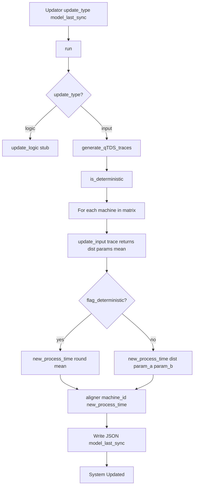

# 0006 — Report: updator.py — Model Update After Validation

## 1. Purpose and role

The module **`dtwinpy/updator.py`** implements **model update** when validation indicators fall **below** the allowed threshold. It can update either:

- **Logic** — Intended for future “model generation” (not implemented yet).
- **Input** — **Distribution fitting** on real process times: for each machine, fit a distribution (e.g. normal, exponential) to the real log and **write the new parameters** (or mean, for deterministic treatment) into the **model JSON** (`contemp` per node).

So the updator **adjusts the digital model’s process-time parameters** using real data, so that the next validation run can perform better.

---

## 2. Dependencies and imports

```python
from .helper import Helper
from .interfaceDB import Database
import numpy as np
import scipy.stats
import warnings
import matplotlib.pyplot as plt
import json
```

- **Helper** — Logging and kill.
- **Database** — Read real log with time window and `model_update=True`.
- **scipy.stats** — Distribution fitting (`fit`, `kstest`, `probplot`).
- **json** — Read/write model file in **aligner()**.

---

## 3. Updator class — overview

Single class **Updator**. Main flow:

- **Constructor:** Store update type (logic/input), digital model, real DB path and time window, **model_last_sync** (path to the JSON file to update), and create the real Database with `model_update=True`.
- **run():** If **logic** → **update_logic()** (stub). If **input** → **generate_qTDS_traces()** (machine process times from real log), **update_input()** per machine (fit distribution, choose best by KS p-value), then **aligner()** to write **contemp** into the JSON.

The JSON that is **written** is **model_last_sync**, which may differ from the path used by the digital model at run time (e.g. a post-sync copy).

---

## 4. Constructor and main attributes

```python
def __init__(self, update_type, digital_model, real_database_path, start_time, end_time,
             model_last_sync, plot=False):
```

| Parameter / attribute | Description |
|-----------------------|-------------|
| **update_type** | `'logic'` or `'input'`. |
| **digital_model** | Model instance; used to get machines and to resolve machine by name in **run()**. |
| **real_database_path** | Path to DB containing `real_log`. |
| **start_time**, **end_time** | Time/event window for reading real log. |
| **model_last_sync** | **Path to the JSON file to update** (e.g. last synced model). All writes go to this file. |
| **plot** | If True, **update_input()** can draw Q-Q plots. |
| **feature_usingDB** | `'valid_logic'` (logic) or `'valid_input'` (input), passed to Database. |
| **real_database** | Database with `event_table='real_log'`, time window, **model_update=True**. |
| **machines_vector**, **queues_vector** | From `digital_model.get_model_components()`. |

---

## 5. Logic update (stub)

### 5.1 update_logic()

- Prints a warning that “Model Generation” is still in progress.
- **pass** — no actual logic update implemented.

Planned use: when validation fails on **logic** (e.g. LCSS), some future logic could alter the model structure or routing; currently only the **input** path is implemented.

---

## 6. Input update — distribution fitting

### 6.1 update_input(input_data, probable_distribution=None)

Fits a set of distributions to **input_data** (e.g. one machine’s process times from the real log), selects the best by **Kolmogorov–Smirnov (KS) test** p-value, and returns the distribution name, parameters, and mean.

**Steps:**

1. **Distribution list:** Only `['norm', 'expon']` are used (others are commented).
2. **Fit:** For each distribution, `scipy.stats.<dist>.fit(input_data)` → parameters.
3. **KS test:** `scipy.stats.kstest(input_data, distribution, args=parameters)` → (D, p-value). Warnings suppressed during fit/kstest.
4. **Best:** Index with **maximum p-value** (prefer p-value close to 1); `ks = [best_dist_name, best_pvalue]`.
5. **Optional plots (if self.plot):**  
   - Q-Q plot with best-fit distribution and its parameters.  
   - If **probable_distribution** is given, Q-Q plot with that distribution and its fitted parameters.
6. **Mean:**  
   - If best is **norm:** `mean = parameters[0]` (loc).  
   - If best is **expon:** `mean = parameters[0] + 1/parameters[1]` (loc + 1/scale).
7. **Return:** `(dist_name, parameters_list, mean)`.

So the caller gets both the chosen distribution and parameters (for writing `["norm", μ, σ]` or similar) and the mean (for writing a scalar when treating the system as deterministic).

---

## 7. Machine traces and determinism

### 7.1 generate_qTDS_traces()

- Same idea as in **Validator**: build process times **per machine** from the real log.
- Uses **get_machines_with_completed_traces()** (only machines with full traces).
- For each machine: **get_time_activity_of_column(column="machine_id", table="real_log", column_id=machine_id[0])** → list of (time, activity_type).
- For each **Started**–**Finished** pair: `processed_time = finished_time - started_time`; append to that machine’s trace.
- **Difference from validator:** If the first event is **Finished** (no preceding Started), the code **does not** add a process time; it resets and continues (see ISSUE #263: no worked_time in update, so that finish is not carried as a process time).
- Returns **dict:** `machine_name → [process_time_1, process_time_2, ...]`.
- Prints the sequence considered for update.

### 7.2 is_deterministic()

- Loops over **machines_vector**.
- If **any** machine has **non-list** `process_time` (i.e. a scalar), sets **flag_is_deterministic = True**.
- Returns that flag.

So “deterministic” here means “at least one machine uses a scalar process time”. In **run()**, when **flag_deterministic** is True, **every** updated machine gets a **scalar** (rounded mean). When False, every updated machine gets a **list** (distribution name + parameters).

---

## 8. Writing the model JSON: aligner()

### 8.1 aligner(machine_id, new_process_time)

- Opens **model_last_sync** (path set in constructor) in read-write mode.
- Loads JSON; finds the node with **node['activity'] == machine_id**.
- Replaces **node["contemp"]** with **new_process_time** (either a number or a list, e.g. `["norm", 17, 2]`).
- Writes the JSON back (seek(0), dump, truncate).

So the **only** field updated in the JSON for input update is **contemp** of the corresponding node. The file updated is always **model_last_sync**, not necessarily `digital_model.get_model_path()`.

---

## 9. run() — main entry point

1. **Logic:** If **update_type == 'logic'**, call **update_logic()** (stub) and stop.

2. **Input:**
   - **generate_qTDS_traces()** → **matrix_ptime_qTDS** (machine_name → list of process times).
   - **is_deterministic()** → **flag_deterministic**.
   - For each **key** in **matrix_ptime_qTDS**:
     - Resolve **machine** = `digital_model.get_selected_machine(machine_name=key)`.
     - **machine_trace** = matrix_ptime_qTDS[machine_name].
     - **update_result** = **update_input(machine_trace)** → `(dist_name, parameters, mean)`.
     - **Deterministic (flag_deterministic True):**  
       - **new_process_time** = round(update_result[-1]) (rounded mean).  
       - If negative, error and kill.
     - **Non-deterministic (flag_deterministic False):**  
       - **new_process_time** = `[dist_name, round(param_a), round(param_b)]`; if param_b is 0, set to 1.
     - **aligner(machine_id, new_process_time)** — write to **model_last_sync**.
   - Print “System Updated”.

So in one **run()**, all machines that appear in **matrix_ptime_qTDS** get their **contemp** updated in the same JSON file, either all as scalars (deterministic) or all as distribution lists (non-deterministic).

---

## 10. High-level flow (Mermaid)



---

## 11. Relation to other modules

| Module / concept | Relation to updator |
|-------------------|----------------------|
| **digital_model** | Provides machines (get_model_components, get_selected_machine); the **path** written is **model_last_sync**, which may be the same or a copy of the model path. |
| **interfaceDB** | **Database** with real_log, time window, **model_update=True**; **get_machines_with_completed_traces()**, **get_time_activity_of_column()** for building machine traces. |
| **validator** | Validator produces the **indicators** that trigger an update; updator uses the **same real log** (and same kind of machine traces as qTDS) to refit and write the model. |
| **Model JSON** | Only **nodes[].contemp** is updated (per machine); file is **model_last_sync**. |

---

## 12. Summary

- **updator.py** updates the digital model when validation is below threshold: **logic** update is a stub; **input** update refits process-time distributions from the real log and writes them to the JSON.
- **update_input()** fits `norm` and `expon` to a machine’s process times, picks the best by KS p-value, and returns distribution name, parameters, and mean.
- **generate_qTDS_traces()** builds per-machine process times from the real log (Started–Finished), matching the validator’s qTDS trace generation but without using “first event Finished” as a process time.
- **aligner()** writes the new process time (scalar or list) into **model_last_sync** for the given machine.
- **run()** for input: generate traces → fit per machine → write all updates to **model_last_sync**; if any machine is deterministic, all updated machines get a scalar (mean), otherwise all get distribution parameters.
