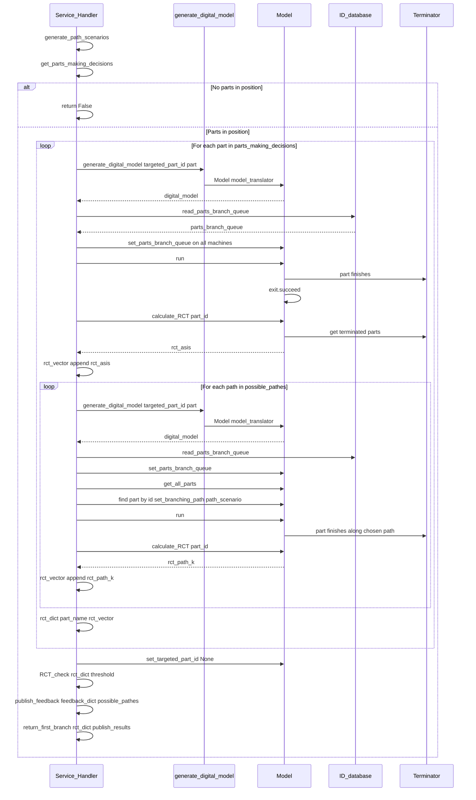
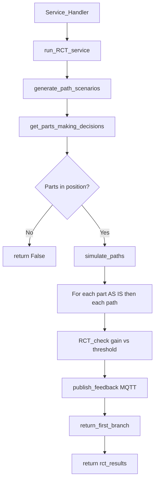
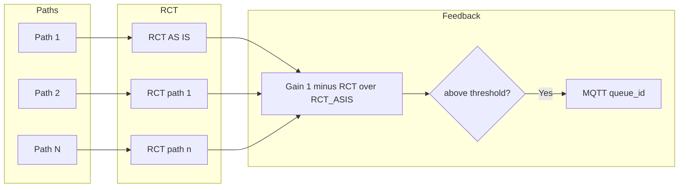

# 0007 — Report: services.py — RCT and Decision-Making Services

## 1. Purpose and role

The module **`dtwinpy/services.py`** implements the **Service_Handler** class: external services of the Digital Twin, in particular:

- **RCT (Remaining Cycle Time) prediction** — Simulate until a given part is finished and return its cycle time.
- **RCT-based decision making at branch points** — For parts approaching a branching machine (one with multiple output queues), generate all **path scenarios** (combinations of branch choices), simulate each scenario, compare RCTs, and **publish** the best path to the physical system (e.g. via MQTT) when the gain is above a threshold.

**Branch point:** A machine with **multiple output queues** (and thus multiple conveyors). The physical system must choose where to send each part; the service recommends the path with the **lowest RCT** when the improvement is significant.

---

## 2. Dependencies and imports

```python
from .broker_manager import Broker_Manager
from .interfaceDB import Database
from .helper import Helper
from matplotlib import pyplot as plt
import re
from time import sleep
```

- **Broker_Manager** — MQTT (or similar) publishing of the chosen path to the physical system.
- **Database** — ID database (branch queue selections, PalletID ↔ PID) and experiment database (RCT tracking).
- **Helper** — Logging and time.
- **re** — Extract part ID from part name in **publish_feedback** and **return_first_branch**.
- **sleep** — Delay between MQTT messages in **publish_feedback**.

---

## 3. Service_Handler class — overview

Single class **Service_Handler**. Main flow:

- **Constructor:** Build digital model via **generate_digital_model()**, create ID and exp databases, get branches and components, set **rct_threshold** and **queue_position**.
- **run_RCT_service()** — Full RCT decision-making pipeline: generate path scenarios → get parts making decisions → simulate all paths per part → RCT_check (gain vs threshold) → publish_feedback (MQTT) → return first-branch results.
- **run_RCT_tracking()** — For a given **palletID**: resolve **PID**, run a single simulation targeted at that part, compute RCT, write to exp database.

---

## 4. Constructor and main attributes

```python
def __init__(self, name, generate_digital_model, broker_manager, rct_threshold=0.02,
             queue_position=2, flag_publish=True):
```

| Parameter / attribute | Description |
|-----------------------|-------------|
| **name** | Service name. |
| **generate_digital_model** | Callable that returns a **Model** (e.g. with optional args like `verbose`, `targeted_part_id`). |
| **broker_manager** | Broker_Manager instance for MQTT publishing; can be None (no publish). |
| **rct_threshold** | Minimum gain (e.g. 0.02 = 2%) above which the best path is recommended. |
| **queue_position** | 1-based position in the branch input queue that triggers “part making decision” (default 2 = second part in queue). |
| **flag_publish** | If True, **publish_feedback** sends MQTT messages; if False, only computes and does not publish. |
| **digital_model** | Result of **generate_digital_model(verbose=False)**. |
| **ID_database** | Database at path derived from digital DB path (replace "digital" with "ID"), event_table `"ID"` — stores branch queue selections, PalletID↔PID. |
| **exp_database** | Database at path with "exp" — stores RCT tracking (PID, RCT, palletID). |
| **branches** | From **digital_model.get_branches()**. |
| **machines_vector**, **queues_vector** | From **digital_model.get_model_components()**. |
| **part_vector** | From **digital_model.get_all_parts()**. |

---

## 5. Branch choices and path scenarios

### 5.1 get_branch_choices()

- For each **branch** in **branches**, get **branch.get_conveyors()** (list of conveyors = output choices).
- Returns **list of lists**: `[ [conveyors of branch 1], [conveyors of branch 2], ... ]`.

Used to build all possible **paths** as combinations of one conveyor per branch.

### 5.2 generate_path_scenarios(verbose=False)

- Calls **get_branch_choices()**.
- Builds **all combinations**: one conveyor per branch per combination (recursive helper).
- Returns **path_scenarios**: list of **paths**, each path = list of **Conveyor** objects (one per branch, in branch order).
- If **verbose**, prints each path with conveyor names.

So **path_scenarios** has size = product of branch sizes (e.g. 2 branches with 2 choices each → 4 paths).

### 5.3 get_parts_making_decisions(queue_position=2)

- For each branch, get **branch.get_branch_queue_in()** (input queue(s)).
- For each queue, get **queue.get_all_items()**.
- If **len(parts_in_queue) > queue_position - 1**, the part at index **queue_position - 1** (1-based “second position” = index 1) is a “part making decision”; append it.
- If **any** branch queue has **no** part at that position, returns **False** (no decision to make).
- Otherwise returns **list of parts** (one per branch, the part at the chosen queue position).

So the service only runs when **every** branch has at least one part in the required position.

---

## 6. Step-by-step: how the simulation and scenarios work

### 6.1 What is a “path scenario”?

- A **branch point** is a machine with **several output queues** (e.g. Machine 2 → Queue to Machine 3 or Queue to Machine 4).
- A **path** is one **combination of choices** at every branch: e.g. “at branch 1 choose conveyor A, at branch 2 choose conveyor C”.
- **Path scenarios** = **all such combinations**. Example: 2 branches with 2 options each → 4 paths (A1, A2, B1, B2).

Each path is represented as a **list of Conveyor objects** (one per branch, in branch order). The machine uses **part.branching_path** to decide which conveyor (and thus which queue) to use when the part leaves.

### 6.2 Why we run one simulation per scenario

- The **physical system** will send the part through **one** of the possible paths. We do **not** know in advance which path will be chosen.
- To **recommend** the best path, we run the **digital model once per path** (plus once “AS IS” with current policy). For each run we **stop when the part of interest finishes** and record its **RCT (Remaining Cycle Time)**.
- **Lower RCT** = that path gets the part finished sooner. We compare RCTs and recommend the path with the **lowest RCT**, but only if the **gain** (vs current “AS IS”) is above **rct_threshold**.

### 6.3 Step-by-step flow of simulate_paths

| Step | Who | Action |
|------|-----|--------|
| 1 | Service | Take **parts_making_decisions** (one part per branch at **queue_position**, e.g. second in queue). |
| 2 | Service | For **each part** in that list (e.g. Part 5): |
| 3 | Service | **Generate a fresh model** with **targeted_part_id = part.get_id()** so the simulation stops when this part completes. |
| 4 | Service | Load **parts_branch_queue** from ID DB and set on all machines (current policy). |
| 5 | Model | **Run simulation** with no extra path override (current alternated/RCT policy). |
| 6 | Model | Simulation stops when **Part 5** finishes at the final machine. |
| 7 | Service | **calculate_RCT(part_id_selected=5)** → **rct_asis**; append to **rct_vector**. |
| 8 | Service | For **each path** in **possible_pathes** (e.g. Path 0, Path 1, Path 2): |
| 9 | Service | **Generate a fresh model** again (same targeted_part_id). |
| 10 | Service | Set **parts_branch_queue** again. |
| 11 | Service | In the new model, find the **Part 5** object and call **part.set_branching_path(path_scenario)** so that at branch points this part **always** follows this path. |
| 12 | Model | **Run simulation**; Part 5 is forced along the chosen path. |
| 13 | Service | **calculate_RCT(part_id_selected=5)** → **rct_path_k**; append to **rct_vector**. |
| 14 | Service | After all paths for Part 5: **rct_dict["Part 5"] = [rct_asis, rct_path0, rct_path1, ...]**. |
| 15 | Service | Repeat from step 2 for the next part (if any). |
| 16 | Service | Clear **targeted_part_id** and **targeted_cluster** so the model is not left in “stop at part” mode. |

So for **P** parts and **S** path scenarios, we run **P × (1 + S)** simulations (each with a new model and one run).

### 6.4 What about the part behind (and all other parts)?

When we simulate “Part A goes to Machine 3” vs “Part A goes to Machine 4”, we only **force the path for the part we are evaluating** (the one at **queue_position**). **All other parts** — including the part **ahead** of Part A in the queue and the part **behind** Part A — **do not** get a path set in that run.

- In code, only the part with `current_part.get_id() == part.get_id()` gets `current_part.set_branching_path(path_scenario)`. No other part receives `set_branching_path` in that scenario.
- So for every other part, the **machine** decides the path using its **default** behaviour:
  - If the part is in **parts_branch_queue** (from the ID database), the machine uses the **RCT** policy (recommended queue from previous recommendations).
  - Otherwise the machine uses its **alternated** policy (e.g. round-robin).

So we **do not** simulate all combinations of “Part A path × Part B path × …”. We **fix** the part behind (and everyone else) to the **current/default** policy (ID DB + alternated) and only **vary** the path for the single part we are evaluating. That avoids a combinatorial explosion and an infinite cascade of “what if the part behind goes to 3 or 4?”. The answer the code gives is: *“If **this** part takes path 3, and everyone else behaves as they do today (current policy), what is this part’s RCT?”*

---

## 7. Assigning paths and simulating (reference)

### 7.1 assign_parts(SelecPath, path_scenarios, SelecPart=None)

- **selected_path** = path_scenarios[SelecPath].
- **Approach 1 (SelecPart == None):** For each branch, if the branch input queue has more than one part, take the part at **index 1** (second position), call **part.set_branching_path(selected_path)**, and append to **parts_in_branching_dm**. Same path is assigned to all such parts at that branch.
- **Approach 2 (SelecPart != None):** Only the part with **part.get_id() == SelecPart.get_id()** gets **set_branching_path(selected_path)** (other parts keep default).
- Returns **parts_in_branching_dm** (list of parts that received the path; used for Approach 1).

**simulate_paths** does not use **assign_parts** directly; it regenerates the model and assigns the path by part ID for each scenario.

### 7.2 simulate_paths(possible_pathes, parts_making_decisions, verbose=True, plot=False)

Implements the flow described in **Section 6.3**: for each part, one AS IS run then one run per path; each run uses a newly generated model and **targeted_part_id** so the simulation stops when that part finishes. **rct_dict** stores, per part, the list **[rct_asis, rct_path1, rct_path2, ...]**.

Optional **plot**: bar chart of RCT per path per part; boxplot of max/min RCT per part.

---

## 8. RCT check and feedback

### 8.1 RCT_check(rct_dict, rct_threshold, possible_pathes, verbose=True, plot=False)

For **each part** in **rct_dict**:

- **rcts_paths** = rct_dict[key]; **ASIS_RCT** = rcts_paths[0].
- Remove first element (AS IS).
- For each remaining **rct**: **rct_indicator** = rct / ASIS_RCT; **rct_gain** = 1 - rct_indicator; append to **gain_vect**.
- **highest_gain** = max(gain_vect).
- If **highest_gain >= rct_threshold**: **flag_feedback** = True, **path_to_implement** = index of that gain in gain_vect (0-based path index).
- **feeback_dict[key]** = (flag_feedback, path_to_implement, highest_gain).

So **path_to_implement** is the index in **possible_pathes** of the best path for that part; if no path beats the threshold, flag is False and index is 0.

Optional **plot**: gain per path per part, with threshold line. **Return:** **feeback_dict**.

### 8.2 publish_feedback(feedback_dict, possible_pathes)

For **each part** in feedback_dict:

- Parse **part_id** from part name (e.g. `"Part 3"` → 3).
- **feedback_flag**, **path_to_implement**, **gain** = feedback_dict[part_name].
- **selected_path** = possible_pathes[path_to_implement].

If **feedback_flag** is True:

- Find **part_location** from **part_vector** (part.get_location()).
- Find the **branch** whose input queue id matches **part_location** (queue id - 1 == part_location) to get **machine_selected** (branch machine) and **selected_branch_id**.
- **queue_id** = selected_path[selected_branch_id - 1].id (conveyor id = queue id).
- If **broker_manager** is not None and **flag_publish** is True: **broker_manager.publishing(machine_id, part_id, queue_id, topic="RCT_server")**.
- Append **queue_id** and **gain** to **queues_selected** and **gains**.
- **sleep(1)** before next message.

**Return:** (feedback_flag, queues_selected, gains). Note: if multiple parts have feedback, only one **feedback_flag** is returned (last in loop); **queues_selected** and **gains** list all.

### 8.3 return_first_branch(rct_dict, publish_results)

- Takes the **first** part name in **rct_dict**.
- **part_id** from name; **path_1** = rct_dict[part_name][0] (AS IS RCT); **path_2** = rct_dict[part_name][1] (first path RCT).
- **feedback_flag** = publish_results[0]; **queue_id** = publish_results[1]; **gains** = publish_results[2].
- **Return:** **(part_id, path_1, path_2, queue_id, feedback_flag, gains)** — used for API or main Digital Twin code.

---

## 9. Main entry points

### 9.1 run_RCT_service(queue_position=2, verbose=True, plot=False)

1. **possible_pathes** = **generate_path_scenarios(verbose)**.
2. **parts_making_decisions** = **get_parts_making_decisions(queue_position)**.
3. If **parts_making_decisions is False** → log warning and **return False** (no parts in position).
4. **rct_dict** = **simulate_paths(possible_pathes, parts_making_decisions, verbose, plot)**.
5. **feedback_dict** = **RCT_check(rct_dict, rct_threshold, possible_pathes, verbose, plot)**.
6. **publish_results** = **publish_feedback(feedback_dict, possible_pathes)**.
7. **rct_results** = **return_first_branch(rct_dict, publish_results)**.
8. **return rct_results** (tuple: part_id, rct_asis, rct_path1, queue_id, feedback_flag, gains).

So one call runs the full pipeline: path generation → part selection → simulations → RCT comparison → optional MQTT publish → first-branch summary.

### 9.2 run_RCT_tracking(palletID)

- **PID** = **ID_database.get_PID_from_PalletID(palletID)** (translate pallet to part ID).
- **targeted_PID** = integer from PID.
- **digital_model** = **generate_digital_model(targeted_part_id=targeted_PID)**.
- **part_in_model** = **digital_model.check_partID_in_simulation(PID)**.
- If **True**: **digital_model.run()** → **RCT** = **calculate_RCT(part_id_selected=targeted_PID)** → **exp_database.write_RCTtracking(PID, RCT, palletID)** and log.
- If **False**: log warning (part not in model, e.g. pallet not yet at Machine 1).

Used to track RCT for a specific pallet over time; results are stored in the experiment database.

---

## 10. Sequence diagram — RCT service (simulate_paths and run_RCT_service)

The following sequence diagram shows how **run_RCT_service** and **simulate_paths** interact with the digital model and how each scenario is run for one part.



---

## 11. High-level flow (Mermaid)





---

## 12. Data structures (summary)

| Structure | Description |
|-----------|-------------|
| **path_scenarios** | List of paths; each path = list of Conveyor (one per branch). |
| **rct_dict** | `{ "Part N": [rct_asis, rct_path1, rct_path2, ... ] }`. |
| **feedback_dict** | `{ "Part N": (flag_feedback, path_to_implement, highest_gain) }`. |
| **publish_results** | (feedback_flag, queues_selected, gains). |
| **rct_results** | (part_id, path_1_rct, path_2_rct, queue_id, feedback_flag, gains) for first part. |

---

## 13. Relation to other modules

| Module / concept | Relation to services |
|-------------------|----------------------|
| **digital_model** | Built via **generate_digital_model()**; used for get_branches, get_model_components, get_all_parts, run, calculate_RCT, check_partID_in_simulation, set_targeted_part_id/cluster. Model is **regenerated** per scenario and per part in simulate_paths. |
| **broker_manager** | **publishing(machine_id, part_id, queue_id, topic="RCT_server")** to send chosen queue to the physical system. |
| **interfaceDB** | **ID_database**: read_parts_branch_queue, get_PID_from_PalletID. **exp_database**: write_RCTtracking. |
| **components** | **Part**: set_branching_path, get_id, get_location. **Branch**: get_conveyors, get_branch_queue_in, get_branch_machine, get_id. **Machine**: set_parts_branch_queue. |

---

## 14. Summary

- **services.py** provides **Service_Handler** for **RCT prediction** and **RCT-based decision making** at branch points.
- **Path scenarios** = all combinations of one conveyor per branch; **parts making decisions** = parts at a given queue position (e.g. second) in each branch input queue.
- **simulate_paths** runs, for each such part, one “AS IS” simulation plus one per path (model regenerated each time, targeted_part_id set); **rct_dict** stores RCT per part per scenario.
- **RCT_check** computes gain (1 − RCT/RCT_ASIS) per path; if max gain ≥ **rct_threshold**, **feedback_dict** marks the best path and **publish_feedback** sends it via **broker_manager** (machine_id, part_id, queue_id).
- **run_RCT_service** runs the full pipeline and returns **return_first_branch** (part_id, rct_asis, rct_first_path, queue_id, feedback_flag, gains).
- **run_RCT_tracking** computes RCT for a given **palletID** (via PID) and writes PID, RCT, palletID to **exp_database**.
