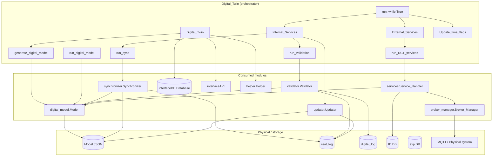
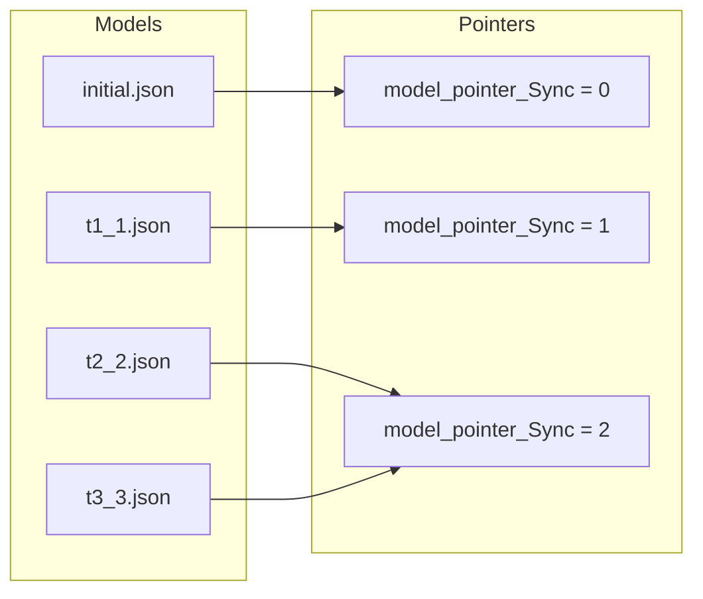
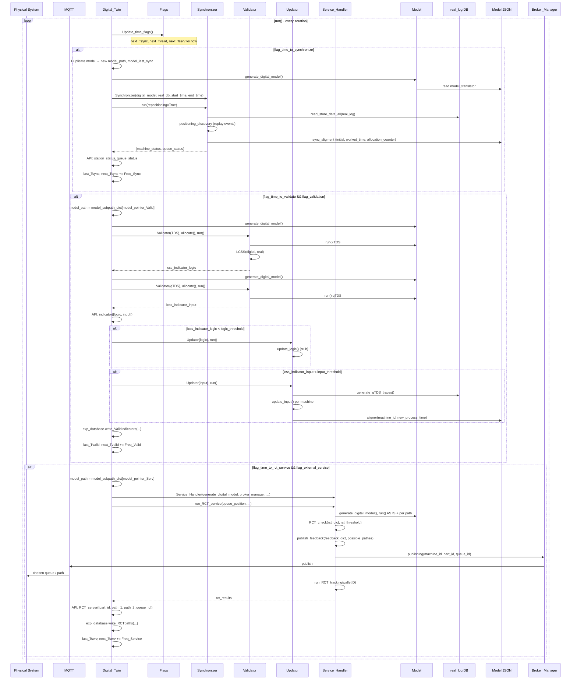
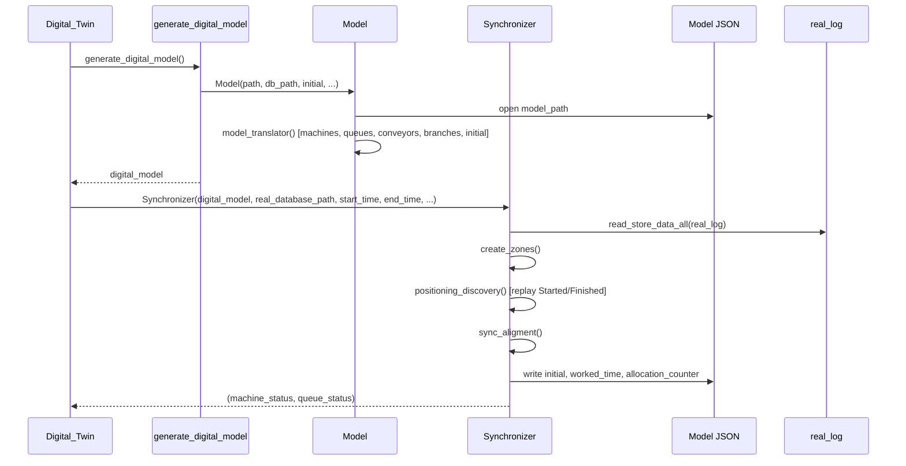
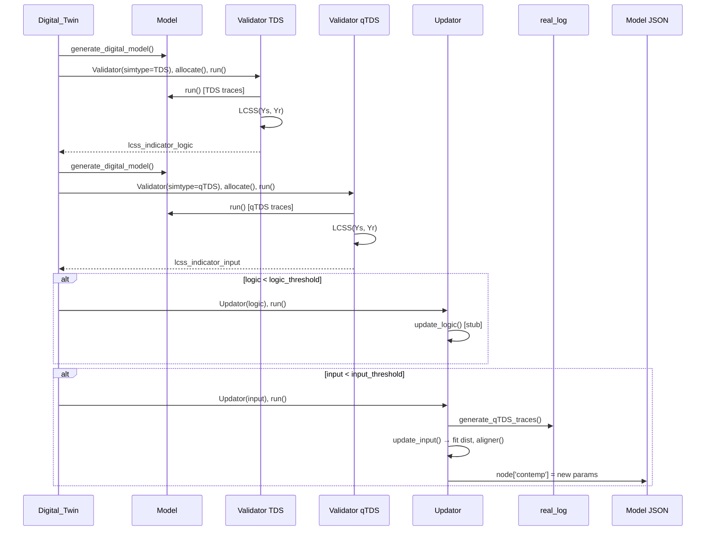
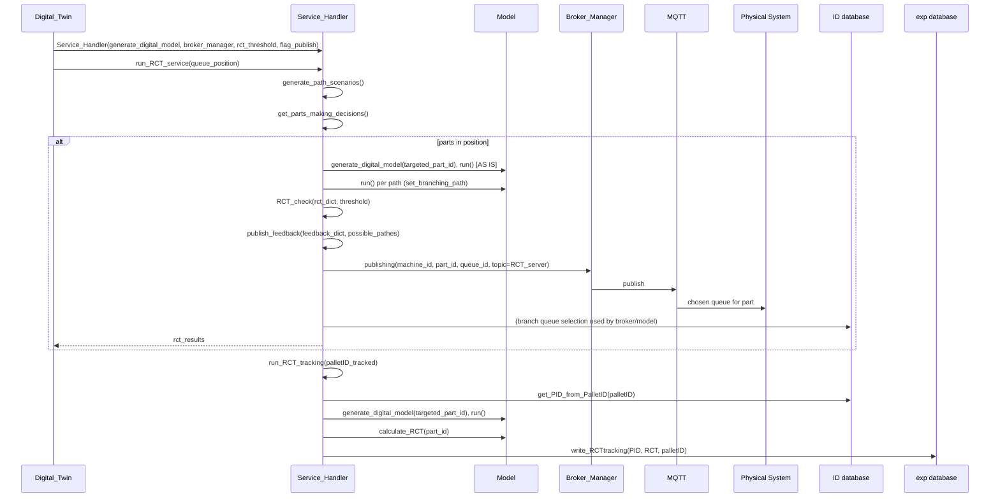
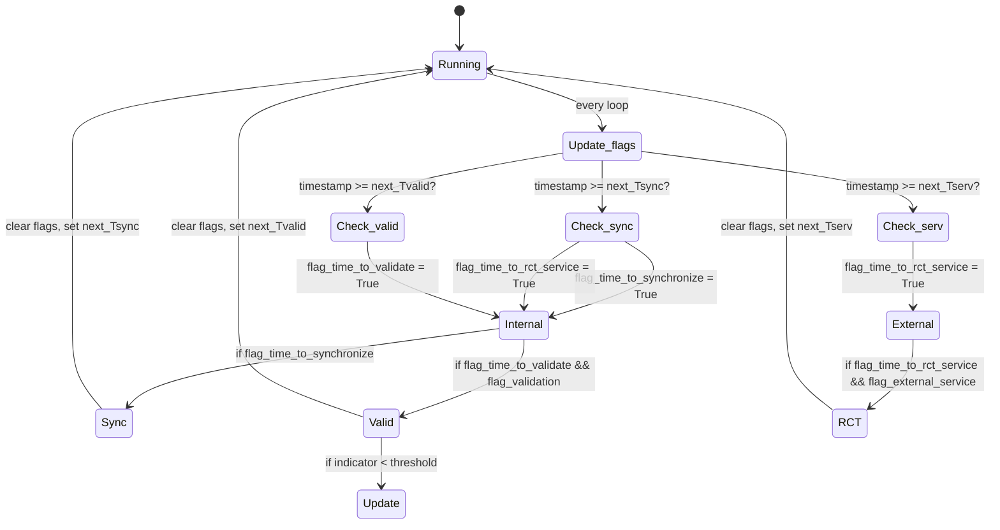

# 0008 — Report: Digital_Twin.py — Orchestrator and Global Operation

## 1. Purpose and role

**`Digital_Twin.py`** is the **top-level orchestrator** of the dtwinpy Digital Twin. It does not implement simulation or sync logic itself; it **consumes all other modules** and drives the **lifecycle**: model creation, synchronization with the physical world, validation (TDS/qTDS), model update when indicators are low, and external RCT-based decision-making service with feedback to the physical system.

**In one sentence:** The **Digital_Twin** instance owns the model path and databases, decides **when** to sync, validate, and run the RCT service (via time flags and frequencies), and calls **Synchronizer**, **Validator**, **Updator**, and **Service_Handler** in the right order with the right parameters.

---

## 2. Module consumption — architecture view

---

## 3. High-level structure of Digital_Twin.py

| Section | Content |
|--------|---------|
| **Imports** | Model, Validator, Database, Synchronizer, Service_Handler, Broker_Manager, Helper, interfaceAPI, Updator; shutil, os, sys, datetime, sleep, random. |
| **Version** | `version = '0.0.3.9'`. |
| **Digital_Twin class** | Single class; no inheritance. |
| **__init__** | Model params, thresholds, DB paths, frequencies, flags, time scheduling (next_Tsync/Valid/Serv), model pointers, model_root/model_path, optional broker, optional API; optionally delete old DBs, create Broker, publish 'start'. |
| **Broker & model** | initiate_broker(); generate_digital_model(); run_digital_model(). |
| **Sync / Valid / RCT** | run_sync(); run_validation(); run_RCT_services(). |
| **Internal_Services()** | If time to sync: duplicate model, run_sync, API; if time to validate: run_validation, optional Updator (logic/input), API, exp DB. |
| **External_Services()** | If time to RCT: run_RCT_services(), API, exp DB. |
| **Update_time_flags()** | Set flag_time_to_synchronize, flag_time_to_validate, flag_time_to_rct_service from current time vs next_Tsync/Valid/Serv. |
| **run()** | while True: Update_time_flags → Internal_Services → External_Services; on KeyboardInterrupt: publish 'stop'. |

---

## 4. Constructor and main attributes (summary)

**Constructor:** `__init__(self, name, copied_realDB=False, model_path=None, ip_address=None, initial=True, targeted_part_id=None, targeted_cluster=None, palletID_tracked='Pallet 1', until=None, digital_database_path=None, real_database_path=None, ID_database_path=None, experimental_database_path=None, Freq_Sync=1000, Freq_Valid=10000, delta_t_treshold=100, logic_threshold=0.75, input_threshold=0.75, rct_threshold=0.02, queue_position=2, Freq_Service=None, part_type="A", loop_type="closed", maxparts=None, template=False, keepDB=True, keepModels=False, plot=False, verbose=True, flag_API=False, flag_external_service=False, flag_publish=True, flag_validation=False, rct_queue=3)`

| Group | Key attributes |
|-------|-----------------|
| **Identity & model** | name, digital_model (None at start), initial, model_path, model_root, model_last_sync, model_subpath_dict, model_pointer_Sync/Valid/Serv. |
| **Thresholds** | delta_t_treshold, logic_threshold, input_threshold, rct_threshold, queue_position, rct_queue. |
| **Stop conditions** | until, maxparts, targeted_part_id, targeted_cluster, palletID_tracked. |
| **Frequencies** | Freq_Sync, Freq_Valid, Freq_Service (default = Freq_Sync). |
| **Time scheduling** | current_timestamp, next_Tsync, last_Tsync, next_Tvalid, last_Tvalid, next_Tserv, last_Tserv. |
| **Flags** | flag_time_to_synchronize, flag_time_to_validate, flag_time_to_rct_service; flag_Validated, flag_synchronized, flag_rct_served; flag_API, flag_external_service, flag_publish, flag_validation. |
| **Databases** | database_path (digital), real_database_path, ID_database_path, experimental_database_path; pointers_database, exp_database. |
| **Broker & API** | ip_address, broker_manager; optional interfaceAPI. |
| **Counters** | counter_Sync, counter_Valid, counter_Serv. |

If **model_path** is None, **model_root** = `models/{name}` and **model_path** = `{model_root}/initial.json`. If **keepDB** is False, digital, real, and ID databases are deleted at init. If **ip_address** is set, **initiate_broker()** is called and **publish_setting_action('start')** is sent after a short wait.

---

## 5. How each module is used

| Module | How Digital_Twin uses it |
|--------|---------------------------|
| **digital_model.Model** | Created via **generate_digital_model()** (model_path, database_path, until, initial, loop_type, maxparts, targeted_part_id, targeted_cluster). **model_translator()** is called inside generate_digital_model. **run()**, **calculate_RCT()**, **check_partID_in_simulation()**, **get_model_components()**, **get_branches()**, **get_model_path()**, **get_model_constrains()**, **set_targeted_part_id/cluster()**, **set_until()** are used from Sync, Validator, Updator, and Services. |
| **Synchronizer** | **run_sync()** builds the model with **generate_digital_model()**, then creates **Synchronizer(digital_model, real_database_path, start_time, end_time, ...)** and calls **synchronizer.run(repositioning)**. Start/end time come from last_Tsync and next_Tsync (or from arguments). Returns (machine_status, queue_status); can send them to API. |
| **Validator** | **run_validation()** creates two validators (TDS and qTDS), each with **generate_digital_model()** first. Sets validator on machines for TDS, then **allocate()** and **run()** for both; compares digital vs real event sequences. Returns [lcss_indicator_logic, lcss_indicator_input]. |
| **Updator** | **Internal_Services()** after validation: if lcss_indicator_logic < logic_threshold, creates **Updator(update_type='logic', ..., model_last_sync)** and **run()**. If lcss_indicator_input < input_threshold, creates **Updator(update_type='input', ..., model_last_sync)** and **run()**. So the JSON updated is **model_last_sync** (the one just synced). |
| **Service_Handler** | **run_RCT_services()** creates **Service_Handler(name="RCT", generate_digital_model=self.generate_digital_model, broker_manager=self.broker_manager, rct_threshold, flag_publish)** then **run_RCT_service()** and **run_RCT_tracking(palletID)**. RCT service uses the **current model_path** (pointed by model_pointer_Serv). |
| **Broker_Manager** | Created in **initiate_broker(ip_address)** if ip_address is not None. Used by Service_Handler for **publish_feedback** (MQTT). Digital_Twin calls **publish_setting_action('start')** at init and **publish_setting_action('stop')** on KeyboardInterrupt. |
| **Database** | **pointers_database** (time_pointers on real DB), **exp_database** (experimental). Real/digital/ID paths are passed to Sync, Validator, Updator, and Services. **write_ValidIndicators**, **write_RCTpaths**, **read_last_end_time** / **read_last_end_time_valid** used in Internal/External services. |
| **interfaceAPI** | If **flag_API**: **station_status(machine_status)**, **queue_status(queue_status)** after sync; **indicator([logic, input])** after validation; **RCT_server([part_id, path_1, path_2, queue_id])** after RCT when feedback is True. |
| **Helper** | Logging, **get_time_now()**, **duplicate_file()**, **delete_old_model()**, **printer()**, **kill()**. |

---

## 6. Model path and pointer management

The Digital Twin keeps **several model JSON files** over time: one **initial** and then one **per sync** (timestamp + pointer).

- **model_subpath_dict**: `{ 0: "initial", 1: "t_1", 2: "t_2", ... }` — mapping from pointer to filename stem (no .json).
- **Before each sync:** Current **model_path** is duplicated to **{model_root}/{timestamp}_{model_pointer_Sync}.json**, then **model_path** and **model_last_sync** are set to this new file. Sync writes to this file.
- **Validation** uses the model at **model_pointer_Valid** (aligned with Sync pointer): **model_path** = **{model_root}/{subpath}.json** with subpath from **model_subpath_dict[model_pointer_Valid]**.
- **RCT service** uses **model_pointer_Serv** the same way.
- After each internal/external service, **model_path** is restored to the “current” subpath so the next sync uses the right baseline.

So: **Sync** creates and writes a **new** JSON copy; **Validation** and **RCT** run on a **previously synced** snapshot; **Updator** writes to **model_last_sync** (last synced file).

---

## 7. Global sequence diagram — main loop and services

The following diagram shows the **global** flow: time check → Internal Services (Sync, then optionally Validation + Update) → External Services (RCT). Physical system and DBs are included to show data flow.

---

## 8. Sequence diagram — Sync only (detail)

---

## 9. Sequence diagram — Validation and optional update

---

## 10. Sequence diagram — RCT service and feedback

---

## 11. Time and flag logic

- **Freq_Sync**: interval between syncs (e.g. 1000 s).
- **Freq_Valid**: interval between validations (e.g. 10000 s); often a multiple of Freq_Sync.
- **Freq_Service**: interval for RCT service; default = Freq_Sync.
- When **timestamp >= next_Tsync**, both **flag_time_to_synchronize** and **flag_time_to_rct_service** are set so that Sync and (if enabled) RCT run in the same loop iteration.

---

## 12. Summary

- **Digital_Twin.py** is the **single entry point** that owns paths, DBs, and timing and **orchestrates** Model, Synchronizer, Validator, Updator, Service_Handler, Broker_Manager, and optional API.
- **generate_digital_model()** builds the **Model** from the current **model_path** and runs **model_translator()**; it is called before every sync, validation, and RCT run (and often multiple times per validation and per RCT path).
- **run_sync()** duplicates the model file (per sync), runs **Synchronizer** on a time window from the real log, and writes **initial**, **worked_time**, and **allocation_counter** back to the new JSON (**model_last_sync**).
- **run_validation()** runs **Validator** in TDS and qTDS mode; **Internal_Services()** then calls **Updator** (logic/input) when indicators are below threshold, writing to **model_last_sync**.
- **run_RCT_services()** creates **Service_Handler**, runs **run_RCT_service()** (path scenarios, simulate, RCT_check, publish_feedback) and **run_RCT_tracking()**; feedback is sent via **Broker_Manager** to the physical system.
- **run()** is an infinite loop: **Update_time_flags()** → **Internal_Services()** (Sync, then Validate + Update) → **External_Services()** (RCT). Model pointers and **model_subpath_dict** keep which JSON is used for Sync vs Validation vs RCT and ensure the correct file is updated and read at each step.
